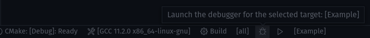
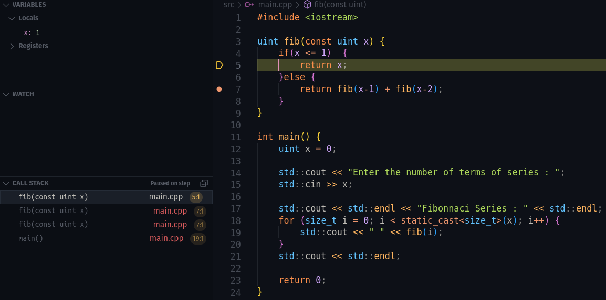

import { Button, Fab } from "@mui/material";

Vous avez déjà dû rencontrer des bugs dans vos programmes, et vous avez sûrement dû utiliser des `std::cout` pour essayer de comprendre ce qu'il se passait.

C'est une méthode qui peut être efficace, mais qui peut aussi être très longue et fastidieuse. Ajouter des `std::cout` partout dans le code, les enlever ensuite, etc.

Heureusement, il existe une solution bien plus efficace : le **débogueur**.

## Qu'est-ce qu'un débogueur ?

Un débogueur est un outil qui permet d'arrêter l'exécution d'un programme à un point précis, appelé **point d'arrêt** (ou **breakpoint** en anglais), ou juste avant qu'un crash se produise.

Une fois atteint, vous êtes en mesure d'inspecter la valeur de toutes les variables (et de toute la mémoire du programme).
Vous pouvez également voir quelles fonctions ont été appelées jusqu'à ce point grâce à la pile d'appel (**callstack**).

Enfin, vous serez en mesure d'avancer pas à pas dans l'exécution.

Nous allons voir dans ce cours comment cela se passe dans **VSCode** en **C++**.

## Configurer le débogueur

Pour commencer, il faut configurer le débogueur.

Si vous avez suivi le cours sur **CMake**, vous n'avez rien à faire, tout est déjà configuré.

Configuration manuelle 

Sinon, sachez qu'il est possible de configurer le débogueur manuellement à l'aide d'un fichier **launch.json**.

Si vous voulez le configurer vous-même, vous pouvez vous rendre dans le panneau "**Run and Debug**" et cliquer sur le bouton "**Run and Debug**".

Vous devez ensuite sélectionner le débogueur que vous voulez utiliser (ici **C++ (GDB/LLDB)**) et cliquer sur **Add Configuration**.

Cela créera un fichier **launch.json** dans un dossier **/.vscode** à la racine du projet.

Si vous voulez plus de détails sur la configuration manuelle, vous pouvez vous rendre [ici](https://code.visualstudio.com/docs/cpp/launch-json-reference).

S'il y a une seule chose à vérifier, c'est que le champ "**program**" pointe bien vers le chemin de votre exécutable.
En général, avec la configuration de **CMake**, il sera sous "${workspaceFolder}/build/bin/Debug/YOURPROGRAM.exe"

## Utiliser le débogueur

Il suffit d'appuyer sur <kbd>CTRL</kbd> + <kbd>F5</kbd>, ou sur l'icône de **debug** :bug: dans la barre inférieure :

Ça y est ! VSCode a lancé le programme en mode débogage. On va pouvoir commencer à l'utiliser.

### Ajouter des points d'arrêt

Comme vous pouvez le voir sur la capture ci-dessous, le programme est arrêté avec une ligne surlignée.

C'est grâce à un point d'arrêt que j'ai ajouté à la ligne $17$.

Vous pouvez ajouter des points d'arrêt en cliquant à gauche de la ligne sur laquelle vous voulez vous arrêter, juste avant le numéro de ligne, ou en appuyant sur <kbd>F9</kbd> après avoir sélectionné une ligne.

Comme son nom l'indique, il permet d'**arrêter** le programme à un endroit précis pour inspecter celui-ci.

### Inspecter les variables

Dans la section **Variables**, vous pouvez voir toutes les variables du programme à l'instant où il est arrêté.

Par exemple, ici **x** vaut **10** !

Vous pouvez également laisser votre curseur sur une variable (hover) qui vous intéresse et un petit encadré va s'afficher pour vous montrer sa valeur.

C'est super utile et évite de devoir ajouter des `std::cout` (ou print/log en fonction des langages) pour afficher les valeurs actuelles de certaines variables.

Il est également possible de regarder spécifiquement certaines variables via la section **Watch**. (Cela peut être utile dans des cas plus complexes avec beaucoup de variables locales qui gênent la visibilité de la section **Variables** par exemple)

Vous pouvez aussi ajouter des expressions à évaluer dans cette section.

Par exemple, si on veut savoir si **x** est supérieur à **3**:

### Inspecter la pile d'appel

La pile d'appel liste les différents appels que le programme a parcouru (**fonctions**/**méthodes**) pour arriver au point où le programme est arrêté actuellement.

Vous pouvez voir que le programme est arrêté dans la fonction **fib** (qui est récursive).
Il est possible de naviguer dans la pile d'appel en cliquant sur les différentes lignes.

### Navigation en mode debug

Une fois que le programme est en mode **débogage**, un ensemble de boutons apparaît en haut de ton écran.

Ces boutons contrôlent l'exécution du programme :

- Le bouton **Continue** permet de lancer l'exécution du programme et de la poursuivre jusqu'à ce qu'un nouveau point d'arrêt soit atteint.

:::note
Celui-ci se transforme en un bouton pause lorsque le programme n'est pas actuellement arrêté.
Cela peut s'avérer utile quand vous avez l'impression que votre programme est bloqué (boucle infinie, appel asynchrone, etc).
:::

- **Step Over** et **Step Into** se déplacent d'une instruction à la fois et gèrent la façon dont les appels de fonctions sont traités.
**Step Over** sautera les appels de fonctions (ou de méthodes), tandis que **Step Into** suivra ces appels (pour rentrer dans la fonction qui va être appelée).

- La quatrième option est **Step Out**. Elle exécute toutes les commandes de la fonction en cours et s'interrompt lorsqu'elle revient à la fonction appelante.

- Les deux dernières options sont **Restart** et **Stop**, qui se passent de commentaire.

### Raccourcis clavier

Si vous utilisez le débogueur pour la première fois vous allez sûrement utiliser les boutons pour vous déplacer.

Mais il est possible d'utiliser des raccourcis clavier pour aller plus vite.
Une fois maîtrisés, ils vous permettront de gagner un temps considérable lors du débogage de vos programmes.

| Continue | Step Over  | Step Into | Step Out | Restart | Stop |
|:-:|:-:|:-:|:-:|:-:|
| <kbd>F5</kbd> | <kbd>F10</kbd> | <kbd>F11</kbd> | <kbd>SHIFT</kbd> + <kbd>F11</kbd> | <kbd>CTRL</kbd> + <kbd>SHIFT</kbd> + <kbd>F5</kbd> | <kbd>SHIFT</kbd> + <kbd>F5</kbd> |
