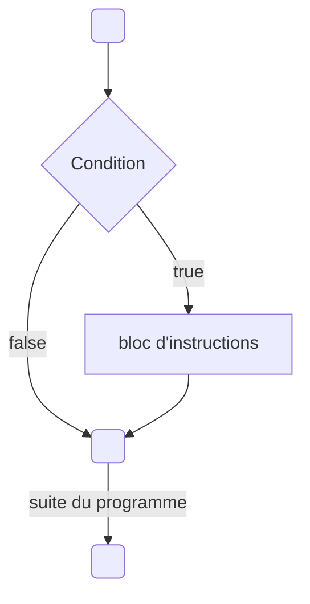

# Introduction

Le C++ va nous permettre d'exprimer des **conditions** sur les valeurs de nos variables afin d'exécuter des instructions différentes en fonction du résultat des conditions.

## Les valeurs booléennes

J'ai omis un type lors du précédent chapitre, il s'agit du **type booléen**, il s'utilise avec le mot clé **bool**.

Ce type peut prendre deux valeurs: soit **true**, signifiant vrai, soit **false** qui veut dire faux. C'est donc idéal pour stocker le résultat d'une condition.

```cpp title="Voici un petit exemple"
int main()
{
    bool const condition { true };
    return 0;
}
```

Cela va devenir intéressant grâce à ce que l'on appelle les **opérateurs de comparaison**.

| Opérateur	| Signification	|
|-|-|
| == |	**Égalité**, compare si deux variables sont **égales** |
| != |	**Inégalité**, compare si deux variables sont **différentes** |
| <  |	**Strictement inférieur**, compare si la variable de gauche est **strictement inférieure** à celle de droite |
| <= |	**Inférieur ou égal**, compare si la variable de gauche est **inférieure ou égale** à celle de droite |
| >  |	**Strictement supérieur**, compare si la variable de gauche est **strictement supérieure** à celle de droite |
| >= |	**Supérieur ou égal**, compare si la variable de gauche est **supérieure ou égale** à celle de droite |

Ces opérateurs vont nous permettre de créer des conditions (des valeurs booléennes) à partir de nos autres variables.

```cpp
#include <iostream>
int main()
{
    float const a { 10.0f };
    float const b { 20.0f };

    std::cout << a << " == " << b << " donne " << (a == b) << std::endl;
    std::cout << a << " != " << b << " donne " << (a != b) << std::endl;
    std::cout << a << " < " << b << " donne " << (a < b) << std::endl;
    std::cout << a << " <= " << b << " donne " << (a <= b) << std::endl;

    // On peut aussi stocker le résultat de la condition dans une variable booléenne
    float const price { 24.5f }
    bool const is_too_expensive { price >= 100.f };

    return 0;
}
```

:::note
Par défaut, ```std::cout``` affiche 1 pour une condition vraie (true) et 0 pour une condition fausse (false).

Il est possible de changer ce comportement en ajoutant un "modificateur" sur le stream ```std::cout```:

```cpp
#include <iostream>
int main()
{
    float const a { 10.0f };
    float const b { 20.0f };

    std::cout << std::boolalpha;
    std::cout << a << " == " << b << " donne " << (a == b) << std::endl;

    return 0;
}
```
:::

## La logique booléenne

Maintenant que nous disposons d'un moyen d'obtenir une valeur booléenne (via les opérateurs de comparaison) nous allons pouvoir manipuler ces valeurs avec ce que l'on nomme des **opérateurs logiques**.

Ces opérateurs vont permettre de combiner et modifier des valeurs booléennes afin d'en obtenir d'autres et faire ce que l'on appelle plus généralement de l’**algèbre booléenne**.
Mais ne vous inquiétez pas, derrière ce nom très mathématique se cache des choses très simples.

### NOT: La négation

L'opérateur ```!``` (placé devant une valeur booléenne) permet d'exprimer la négation d'une condition.

:::note
C'est ici un opérateur dit **unaire** (qui s'applique sur une seule valeur) et donne en retour la condition inverse.
:::

Voici ce qu’on appelle la **table de vérité** de l’opérateur **NOT**, qui formalise les entrées et les sorties de cet opérateur.

| A     | Résultat |
|-------|----------|
| true  | false    |
| false | true     |

```cpp
float price { 114.2f };
bool isExpensive { price >= 100.f };

bool isCheap { !isExpensive };
```

### AND
L'opérateur ```&&``` (placé entre deux valeurs booléennes) permet d'exprimer la validité de deux conditions **en même temps**.
On peut l'interpréter en français par : "ma condition1 est vraie **ET** ma condition2 est aussi vraie".

| A     | B     | Résultat |
|-------|-------|----------|
| true  | true  | true     |
| true  | false | false    |
| false | true  | false    |
| false | false | false    |

## OR

L'opérateur ```||``` (placé entre deux valeurs booléennes) permet d'exprimer si **au moins une des deux** conditions est **vraie**.
On peut l'interpréter en français par : "ma condition1 est vraie **OU** ma condition2 est vraie".


| A     | B     | Résultat |
|-------|-------|----------|
| true  | true  | true     |
| true  | false | true     |
| false | true  | true     |
| false | false | false    |

---

:::note
Il est également possible d'utiliser les mots-clés ```and```, ```or``` et ```not``` pour remplacer respectivement les opérateurs ```&&```, ```||``` et ```!```.

C'est possible mais très peu répandu en C++ c'est pourquoi je ne l'utiliserai pas personnellement mais sachez que ça existe également.

Avec de vielles versions de Visual Studio il est possible que cette syntaxe ne fonctionne pas et dans ce cas il faut inclure le fichier ```<ciso646>```.
:::

:::danger
Pour l'opérateur **AND** (```&&```) on note qu'il y a bien deux fois le symbole <kbd>&</kbd>. C'est très important car il existe un autre opérateur (avec un seul **&**) qui fait tout autre chose.
Je ne détaillerai pas dans ce chapitre son utilité mais il est important de le souligner car c'est une erreur qui arrive fréquemment.

De même pour l'opérateur **OR** (```||```) différent de <kbd>|</kbd>.
:::

## Des structures de contrôle

C'est bien beau toutes ces valeurs booléennes mais comment on peut s'en servir pour exécuter une partie d'un code ou un autre en fonction d'une condition ?

### Si
Notre première structure de contrôle va s'utiliser avec le mot clé **if**.
De l'anglais, ce mot clé signifiant **"si"**, exécute des instructions si et seulement si la condition donnée est vraie.

Un petit schéma d'explications:



Voilà comment l'utiliser. Toutes les instructions entre accolades seront exécutées si la condition est vraie.

```cpp
if( /* condtion */ )
{
    // ...
}
```

```cpp title="Un petit exemple"
#include <iostream>
int main()
{
    float price { 114.2f };

    if ( price >= 100.f )
    {
        // appliquer une réduction si l'on dépasse un certain prix
        price *= 0.9f;
    }

    std::cout << "Le prix final est de " << price << "€" << std::endl;

    return 0;
}
```

:::caution
Il est possible de créer des variables à l'intérieur même des accolades de la structure de contrôle mais celles-ci sont restreintes à cette **portée**.
C'est ce qu'on appelle la portée des variables (**scope** en anglais).

Plus généralement, cette règle du C++ s'applique à n'importe quel bloc entre accolades.
**Une variable n’est utilisable que dans la portée, ou le bloc d’accolades où elle a été déclarée.**

Nous en reparlerons plus en détail dans d'autres chapitres.
:::

:::caution
Il n'est pas très utile de tester par une égalité le résultat d'une condition :
```cpp
float const price { 114.2f };
bool const isExpensive { price >= 100.f };

if ( isExpensive == true )
{
    // ...
}
```
```isExpensive``` ici étant déjà une valeur booléenne ajouter une égalité supplémentaire avec la valeur ```true``` ne va rien faire d'autre que de créer une nouvelle valeur booléenne qui a la même valeur.

Il est donc plus clair et concis d'écrire directement:

```cpp
bool const isExpensive { price >= 100.f };

if ( isExpensive )
{
    // ...
}
```
:::

### Sinon

C'est très bien de pouvoir effectuer quelque chose si une condition est vérifée mais comment faire si l'on veut effectuer une action A si la condition est vérifée et une autre action B si ce n'est pas le cas ?

On pourrait très bien enchaîner deux ```if``` avec la condition opposée:

```cpp
#include <iostream>
int main()
{
    float temperature { 24.0f };

    if ( temperature >= 35.f )
    {
        std::cout << "il fait chaud" << std::endl;
    }

    if ( temperature < 35.f )
    {
        std::cout << "il fait froid" << std::endl;
    }

    return 0;
}
```

Mais c'est là que le mot-clé ```else``` (de l'anglais "sinon") nous permet d'exécuter des instructions si la condition du ```if``` est fausse de manière plus compréhensible:

```cpp
#include <iostream>
int main()
{
    float temperature { 24.0f };

    if ( temperature >= 35.f )
    {
        std::cout << "il fait chaud" << std::endl;
    }
    else
    {
        std::cout << "il fait froid" << std::endl;
    }

    return 0;
}
```

Ici le **else** n'a pas de parenthèse et indique donc "tout le reste" (ce qui ne vérifie pas la condition).

:::note
L'opérateur logique de négation <kbd>!</kbd> est parfois très utile dans le cas où l'on avait stocké une valeur mais l'on souhaite faire une suite d'instructions uniquement dans le bloc ```else``` du ```if```.

Au lieu de faire :
```cpp
#include <iostream>
int main()
{
    bool condition { false };

    if ( condition )
    {
        // ... ne rien faire
    }
    else
    {
        // effectuer nos instructions
    }

    return 0;
}
```

Il est préférable de faire:

```cpp
#include <iostream>
int main()
{
    bool condition { false };

    if ( !condition )
    {
        // effectuer nos instructions
    }

    return 0;
}
```
:::

Mais comment tester une succession de conditions différentes avant de faire "tout le reste" ?

### Sinon si

On pourrait très bien chaîner plusieurs ```if``` et ```else``` imbriqués de cette manière:

```cpp
#include <iostream>
int main()
{
    float temperature { 24.0f };

    if ( /* condition1 */ )
    {
        // ...
    }
    else
    {
        if ( /* condition2 */ )
        {
            // ...
        }
        else
        {
            if ( /* condition3 */ )
            {
                //...
            }
            else 
            {
               //...  
            }
        }
    }
    return 0;
}
```

Mais vous êtes sûrement d'accord pour dire que ça commence à être difficile à suivre et écrire à cause des imbrications.
Le C++ est bien fait et nous permet de d'utiliser la combinaison ```else if``` pour ce cas de figure.

```else if``` s’utilise entre un ```if``` et un ```else``` et signifie "ou alors si cette condition est vraie".

```cpp
#include <iostream>
int main()
{
    if ( /* condition1 */ )
    {
        // ...
    }
    else if ( /* condition2 */ )
    {
        // ...
    }
    else  if ( /* condition3 */ )
    {
        //...
    }
    else
    {
        //...  
    }

    return 0;
}
```

:::note
Enfin, il existe une dernière syntaxe (le ```switch``` pour les curieux) qui permet de faire quelque chose de similaire au ```else if``` mais il nous manque quelques notions et je vous le présenterai donc au chapitre suivant sur les boucles.
:::

## Combinaison d'expressions

Avec tous les opérateurs logiques vu précédemment il est même possible de tester plusieurs conditions dans un même ```if```.

```cpp
#include <iostream>
int main()
{

    float temperature { 24.0f };
    bool const isRaining { false };
    bool const wantToGoOut { true };
    bool const ownsAnUmbrella { false };

    if ( wantToGoOut && (!isRaining || (isRaining && ownsAnUmbrella) ) )
    {
        // ...
    }
    else
    {
        //...  
    }

    return 0;
}
```

:::danger
Les opérateurs logiques sont comme les opérateurs mathématiques que nous avons vus dans les chapitres précédents: ils ont une priorité.

1. Le plus prioritaire est la négation <kbd>!</kbd>
2. Ensuite c'est le **ET** <kbd>&&</kbd>
3. Enfin, le **OU** <kbd>||</kbd> est le moins prioritaire

Par exemple avec le code ```a && b || c && d```, dans l’ordre, on évalue ```a && b```, ```c && d``` et enfin ```(a && b) || (c && d)```.

Pour des raisons de lisibilité je vous recommande très fortement d'ajouter des parenthèses (comme dans mon exemple ci-dessus) pour expliciter quelles opérations vous voulez prioriser dans ce genre de cas plus "complexe".

:::

### Pour aller plus loin

Enfin, pour aller encore plus loin il est possible de manipuler les opérateurs ```&&```, ```||``` et ```!``` et trouver des expressions donnant le même résultat.
Cela permet parfois de simplifier le code ou alors d'exprimer la condition sous une forme plus lisible ou compréhensible.

Dans mon exemple précédent la condition ```(!isRaining || (isRaining && ownsAnUmbrella))``` est équivalente à écrire ```(!isRaining || ownsAnUmbrella)```.

Il existe aussi le **théorème de De Morgan** qui permet d'exprimer la négation d'un **ET** avec un **OU** et inversement.

Il est possible d'exprimer mon exemple précédent sous cette forme:

```(!isRaining || ownsAnUmbrella)``` équivalent à ```!(isRaining && !ownsAnUmbrella)```

On peut s'en convaincre en essayant de traduire ces conditions en phrases:

```(!isRaining || ownsAnUmbrella)```: c'est le cas où il ne pleut pas ou alors j'ai un parapluie.
```!(isRaining && !ownsAnUmbrella)``` ce n'est **pas** le cas où il pleut et je n'ai pas de parapluie.

Vous trouverez des exemples de propriétés et simplifications possibles sur la page Wikipédia suivante:
[Algèbre de Boole](https://fr.wikipedia.org/wiki/Alg%C3%A8bre_de_Boole_(logique))

## En résumé

- Une valeur booléenne est du type **bool** et peut prendre comme valeur ```true``` ou ```false```.
- On obtient une valeur booléenne avec une condition sur nos variables (avec les opérateurs de comparaison <kbd>==</kbd>, <kbd>!=</kbd>, <kbd>></kbd>, <kbd><=</kbd>, <kbd>></kbd> ou <kbd>>=</kbd>)

- Les opérateurs <kbd>&&</kbd>, <kbd>||</kbd> et <kbd>!</kbd> permettent de modifier et combiner les valeurs booléennes.
- On utilise les structures de contrôle ```if```, ```else```, ```else if``` pour exécuter des instructions différentes en fonction des conditions.