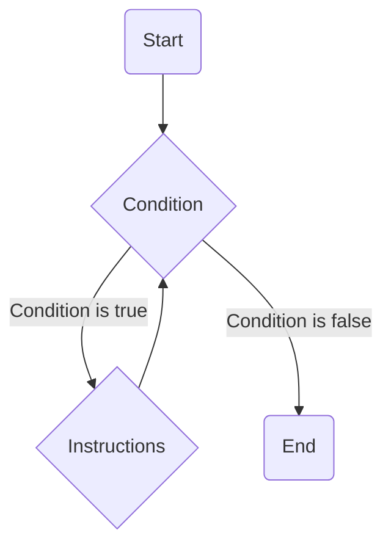

Nous avons maintenant la capacité d'exécuter des codes différents en fonction de **conditions**.
Cependant, notre programme reste essentiellement linéaire, car nous exécutons les instructions de haut en bas, l'un à la suite des autres.

Nous allons maintenant explorer de nouvelles structures de contrôle: les **boucles**.
Elles vont nous permettre de répéter plusieurs fois une série d'instructions, selon nos besoins.

## While - "Tant que ..."

La première est la boucle **while**, de l'anglais qui signifie "tant que".
Elle exécute une série d’instructions tant qu'une condition est vraie. 
Une fois que la condition devient fausse la boucle s’arrête et passe à la suite.



```cpp title="Un petit exemple"
#include <iostream>
int main()
{
    int count { 0 }; // initialisation (d'un compteur ou autre chose lié à la boucle)
    while ( count < 10 /* condition */)
    {
        std::cout << count << std::endl; // Instructions
        count++; // Itération (mise à jour du compteur généralement)
    }

    return 0;
}
```

Le code évalue la condition avant d'effectuer quoi que ce soit. Dans notre cas si le **compte est supérieur à 0** alors on va afficher le nombre et le décrémenter.
Quand finalement count vaut 0, la condition devient fausse, on passe à la suite du code. (**on ne va donc pas afficher la valeur 0**)

:::caution
Attention aux **boucles infinies** !

Lorsque vous créez une boucle, assurez-vous qu'elle puisse s'arrêter à un moment ! Si la condition est toujours vraie, votre programme ne s'arrêtera jamais !
:::

## Do while

De manière très similaire il existe la boucle ```Do... while```, qui signifie "fait .. tant que..."

Ce type de boucle est moins utilisé. La seule chose qui change par rapport à une boucle while, c'est la position de la condition : au lieu d'être au début de la boucle, la condition est à la fin.

:::note
La boucle ```while``` peut très bien ne **jamais** être exécutée si la **condition est fausse dès le départ**.
Dans mon exemple précédent, si on avait initialisé le count à ```-1```, la condition aurait été fausse dès le début, et on ne serait jamais rentré dans la boucle.
:::

Pour la boucle ```Do... while```, on rentre **au moins une fois** à l'intérieur. Le test se fait à la fin.

Il est donc parfois utile de faire des boucles de ce type, pour s'assurer que l'on rentre au moins une fois dans la boucle.

```cpp
#include <iostream>
int main()
{
    int sum {0};
    int number;
    
	do {
		std::cout << "Entre un nombre: ";

		std::cin >> number;

		sum += number;

	} while (number != 0);

	std::cout << "La somme vaut " << sum << std::endl;

	return 0;
}
```

:::caution
Il y a une petite spécificité supplémentaire ici, il faut ajouter un "**;**" à la fin de la ligne contenant la condition while.
:::

## For

Un des cas les plus fréquents avec les boucles est d'avoir un compteur et un nombre d'itérations prédéfini.

On pourrait très bien le faire avec la boucle ```while```:

```cpp
int count { 0 }; // initialisation (d'un compteur ou autre chose lié à la boucle)
while ( count < 10 /* condition */)
{
    // Instructions
    count++; // Itération (mise à jour du compteur généralement)
}
```

Mais il existe une boucle dédiée à cela qui permet de séparer le reste de notre code de ce qui est lié à la boucle. Cela rend le code plus clair et plus compréhensible surtout dans le cas ou l'on connait à l'avance le nombre d'itérations.

C'est la boucle ```for``` ("**pour**" en anglais) et elle s'utilise selon le schéma suivant:

```cpp
for (int count {0} /*initialisation*/ ; count < 10 /*condition*/ ; count++/*Itération*/)
{
    // Instructions
}
```

Voilà le même exemple qu'avec la boucle ```while``` mais ici avec la boucle ```for``` :

```cpp
#include <iostream>
int main()
{
    for (int count { 0 }; count < 10 ; count++)
    {
        std::cout << count << std::endl;
    }

    return 0;
}
```

L'avantage ici est que le détail de ce que fait la boucle est concentré sur la même ligne.

:::info
Un autre gros avantage est que la **portée de la variable** (**scope**) est **limitée** à la boucle et donc rend notre code plus sûr et propre.

```cpp
#include <iostream>
int main()
{
    for (int count { 10 }; count > 0 ; count--)
    {
        std::cout << count << std::endl;
    }
    
    std::cout << count << std::endl;

    return 0;
}
```

La variable ```count``` ici est uniquement nécessaire pour la boucle en question et n'a donc pas lieu d'être partagée ensuite avec le reste du code pour éviter des erreurs.
Si on essaye de le faire le compilateur nous donne l'erreur suivante:

```bash title="Compilation failed due to following error(s)"
main.cpp: In function ‘int main()’:
main.cpp:17:18: error: ‘count’ was not declared in this scope
   17 |     std::cout << count << std::endl;
      |                  ^~~~~
```
:::

Mais alors quand choisir une boucle ```while``` ou une boucle ```for``` ?

C'est une question légitime et il n'y a pas de bonne réponse, vous êtes libre.
En général on utilise une boucle ```for``` dans le cas où l'on connait le nombre d'itérations à l'avance (un compteur, un nombre de niveaux ou de joueurs dans un jeu, etc...).
La boucle ```while```, quant à elle, est généralement utilisée pour effectuer des actions sans savoir à l'avance le nombre d'itérations que l'on va effectuer (par exemple la gestion de l'entrée utilisateur ou dans un jeu faire bouger un ennemi **tant qu**'il n'a pas atteint sa cible)

:::tip
Plus simplement, essayez de dire ce que vous voulez faire et si votre phrase contient "**pour**" ou "**pour chaque ... faire ...**" il est préférable d'utiliser une boucle ```for```. Et si vous vous dîtes "**Tant que ... faire ...**" alors vous devriez utiliser une boucle ```while```.
:::

## Contrôler l'exécution

Les boucles sont très utiles, mais parfois on aimerait pouvoir contrôler plus finement les instructions à l’intérieur des accolades et pouvoir s'arrêter plus tôt ou ne pas exécuter les instructions pour un cas particulier.

Il existe en **C++** deux mots-clés: **break** et **continue**

### Break
**Break** (de anglais "casser"/"interrompre") permet d'interrompre une boucle et mettre fin à l’exécution de celle-ci peu importe où on en est.

Voyons un exemple plus "complexe" ensemble:
```cpp
for (int i { 0 }; i < 5; ++i)
    {
        std::cout << "i : " << i << std::endl;
        
        for (int j { 0 }; j < i; ++j)
        {
            if (j == 2)
            {
                std::cout << "break j == 2" << std::endl;
                break;
            }
    
            std::cout << "j : " << j << std::endl;
        }
        std::cout << std::endl;
        
    }
```

qui nous donne le résultat suivant:

```bash
i: 0

i: 1
j: 0

i: 2
j: 0
j: 1

i: 3
j: 0
j: 1
break j == 2

i: 4
j: 0
j: 1
break j == 2
```

Ici il y a plusieurs choses qui se passent:
- il y a déjà deux boucles imbriquées, et oui rien ne nous empêche de faire cela en C++
- la deuxième boucle (sur la variable **j**) dépend de la variable **i** de la première (c'est parfois utile de le faire et je vous montre donc un petit exemple)
- ici le mot clé ```break``` permet d'interrompre la boucle de la variable j si la valeur de j est égale à 2.

Une petite analyse des itérations s'impose:

- la première fois i est égal à 0 et donc la condition ```j < i``` est directement fausse vu que j aussi est égal à 0.
ensuite
- ensuite i est égal à 1 et donc on passe une fois seulement dans la boucle du j car à la seconde itération j devient égal à i et invalide la condition ```j < i```.
- la troisième fois c'est le ```break``` qui entre en jeu et permet d'interrompre la boucle quand j est égal à 2 (à noter que la condition de la boucle aurait aussi invalidé la condition ```j < i```)
- enfin ici le ```break``` prend tout son sens car s'il n'était pas là, on aurait encore continué un tour car j étant égal à 3, la condition (```j < i```) serait valide car i est égal à 4 et que ```3 < 4```.

:::caution
Comme nous venons de le voir, dans le cas de boucles imbriquées cela arrête seulement la boucle du niveau au dessus et pas toutes les boucles.
:::

### Continue

L’autre mot-clé, ```continue```, permet de sauter l’itération courante.

Toutes les instructions restantes du bloc sont ignorées et la boucle continue au tour suivant.

```cpp
for (int i { 0 }; i < 5; ++i)
{
    if( i == 3)
    {
        continue;
    }
    std::cout << "i : " << i << std::endl;
}
```
Ce qui nous donne:

```bash
i : 0
i : 1
i : 2
i : 4
```

:::danger
Comme cela interrompt la totalité des instructions suivantes de la boucle cela peut être dangereux dans le cas d'une boucle **while**:

```cpp
#include <iostream>
int main()
{
    int count { 10 };

    while (count > 0)
    {
        std::cout << count << std::endl;

        if (count == 5)
        {
            continue;
        }
        count--;
    }

    return 0;
}
```

Ici, l'instruction de ```count--;``` ne sera donc jamais appelée une fois que ```count``` devient égal à 5.
```count``` restera donc égal à 5 indéfiniment: C'est une **boucle infinie**.
:::

## Switch

Mainteant que nous avons toutes les cartes en main revenons brièvement au **switch** dont je vous parlais au chapitre précédent sur les conditions.

Très souvent on veut tester la valeur d'une variable et effectuer telle ou telle action en fonction. On pourrait très bien écrire cela avec des ```else if```:

```cpp
#include <iostream>
int main()
{
    int value { 42 };
    if ( value == 12 )
    {
        // ...
    }
    else if ( value == 33 )
    {
        // ...
    }
    else  if ( value == 52)
    {
        //...
    }
    else {
        //...  
    }
    return 0;
}
```

C'est avec le mot clé ```switch``` que l'on va pouvoir faire cela de façon plus lisible:

```cpp
#include <iostream>
int main()
{
    int value { 42 };
    switch (value)
    {
        case 12:
            // ...
            break; // permet de quitter le bloc switch
        case 33:
            // ...
            break;
        case 52:
            // ...
            break;
        default:
            // ...
            break;
    }

    return 0;
}
```

Lorsque l'expression testée est égale à une des valeurs listées avec les mots-clés ```case``` la **totalité** des instructions qui suivent sont exécutées. 
Le mot clé ```break``` indique la sortie de la structure de contrôle.
Le mot clé ```default``` indique quelles instructions exécuter si l'expression n'est jamais égale à une des valeurs.

:::danger
De manière générale, n'oubliez pas d'insérer des instructions ```break``` entre chaque test, ce genre d'oubli est difficile à détecter car aucune erreur n'est signalée...
En effet la **totalité** des instructions suivant le ```case``` sont exécutées et donc on pourrait se retrouver à exécuter des instructions de manière involontaire.

```cpp
#include <iostream>
int main()
{
    int value { 33 };
    switch (value)
    {
        case 12:
            std::cout << "value est égale à 12" << std::endl;
        case 33:
            std::cout << "value est égale à 33" << std::endl;
        default:
            std::cout << "value est différent de 12 ou 33" << std::endl;
    }

    return 0;
}
```
qui nous donne:

```bash
value est égale à 33
value est différent de 12 ou 33
```

Cela peut être parfois voulu mais ici on se rend bien compte qu'il y a un problème et il ne faut donc pas oublier le mot clé ```break```.

Voici un exemple où cela peut être utile:

```cpp
#include <iostream>
int main()
{
    char letter { 'e' };
    switch(letter)
    {
        case 'a':
        case 'e':
        case 'i':
        case 'o':
        case 'u':
        case 'y':
            std::cout << "You entered a vowel." << std::endl;
            break;
        default:
            std::cout << "You entered a consonant." << std::endl;
            break;
    }

    return 0;
}
```

Certains warnings de compilateur permette d'indiquer ce genre de cas mais c'est mieux d'y faire attention.

:::

## Résumé

- Il existe trois types de boucle:
  - la boucle ```while``` qui permet d'exécuter des instructions tant qu'une condition est vérifiée.
  - la boucle ```Do while``` qui permet de faire la même chose que la boucle ```while``` mais en faisant le test seulement à la fin et permettant d'exécuter les instructions **au moins une fois**.
  - la boucle ```for``` plus utile en pratique quand l'on connait à l'avance le nombre d'itérations à effectuer. Elle permet aussi de mieux "scoper" les variables et **limiter leur portée**.

- Il existe deux mots-clés ```break``` et ```continue``` qui permettent de contrôler plus finemment les boucles.
- La structure de contrôle ```switch``` est une alternative au ```else if```.