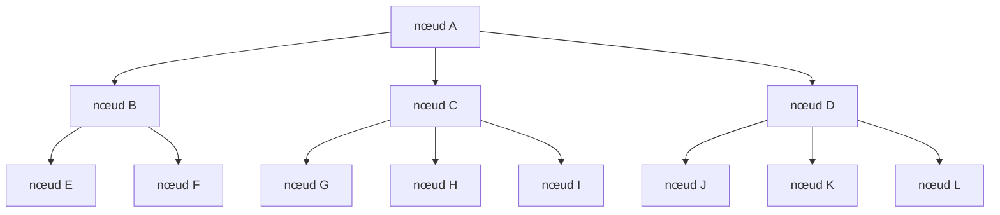
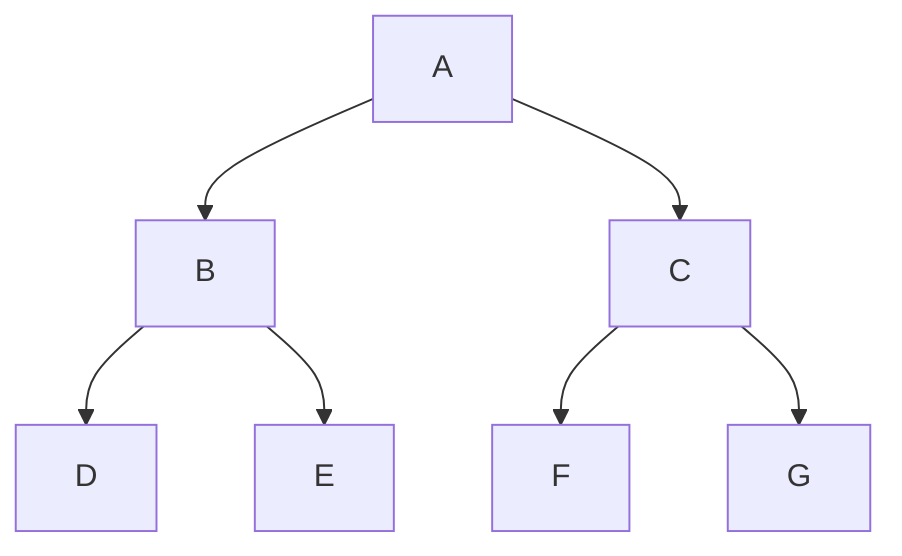
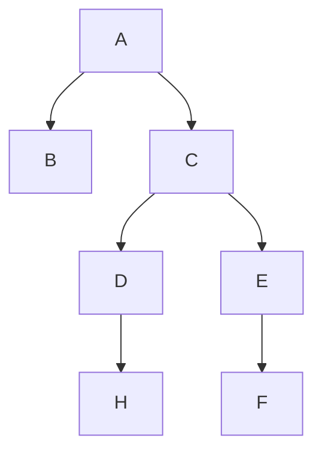

Dans ce chapitre nous allons découvrir une nouvelle structure de données: les arbres. Et plus particulièrement les arbres binaires.

La notion d'**arbre** est une notion très importante en informatique. 
Un arbre est une **structure de données** qui permet de représenter des données **hiérarchiques** comme par exemple des dossiers et des fichiers dans un système de fichiers.

Un arbre est composé de **nœuds**. Chaque nœud peut avoir un nombre quelconque de **fils**. Un nœud qui n'a pas de fils est appelé une **feuille**.

Un arbre est composé d'un **nœud racine** qui est le nœud de départ de l'arbre. Il est possible d'accéder à tous les autres nœuds de l'arbre à partir du nœud racine.



### Profondeur d'un nœud

La **profondeur** d'un nœud est le nombre de nœuds qui le séparent du nœud racine. En considérant que la profondeur du nœud racine est 1.

Dans notre exemple, la profondeur du nœud racine `A` est 1. La profondeur du nœud `B` est 2. La profondeur du nœud `E` est 3. etc..

### Hauteur d'un arbre

La **hauteur** d'un arbre est la profondeur maximale de ses nœuds. C'est à dire la profondeur du nœud le plus profond.

## Arbres binaires

Il existe plusieurs types d'arbres qui ont des propriétés différentes. On peut par exemple se limiter à un nombre maximum de fils par nœud, imposer un ordre sur les fils d'un nœud, ou encore imposer que chaque nœud ait un nombre fixe de fils.

C'est le cas des **arbres binaires**. Un **arbre binaire** est un arbre dont chaque nœud a au maximum deux fils. Un fils gauche et un fils droit.

C'est une structure de données très utilisée en informatique et c'est ce que nous allons étudier.

## Représentation d'un arbre binaire

### Structure par récursivité

Pour représenter un arbre binaire une solution qui peut sembler naturelle est d'utiliser une structure récursive. C'est à dire une structure qui contient des éléments de son propre type.

En effet, n'importe quel nœud de l'arbre, peut être vu comme un sous arbre binaire dont la racine est ce nœud. Ce jeu de l'esprit permet de comprendre qu'un nœud **pointe** vers deux autres nœuds qui sont les fils gauche et droit de ce nœud.

Il peut ne pointer vers aucun nœud, dans ce cas il est une feuille. Sinon, ce nœud représente un embranchement de l'arbre.

Mais on peut se demander comment représenter ce lien (qui peut ne pas exister dans le cas d'une feuille) entre un nœud et ses fils.

C'est là qu'interviennent les **pointeurs**. On peut représenter ce lien en utilisant des pointeurs vers les nœuds fils.

:::caution
On ne peut pas utiliser des **références** car elles doivent être une **référence vers un objet existant**. Or, dans le cas d'une feuille, il n'y a pas de nœud fils.
:::

Le pointeur lui peut être nul, c'est à dire qu'il ne pointe vers aucun objet. C'est cette particularité qui permet de représenter le cas d'une feuille.

Voilà à quoi ressemble la **structure** que l'on va utiliser pour représenter un **arbre binaire**:
```cpp
struct Node {
    int value;
    Node* left;
    Node* right;
};
```

Elle est composée d'un entier qui représente la valeur du nœud (cela peut être n'importe quel type de donnée), et de deux pointeurs vers des nœuds qui représentent les fils gauche et droit.

C'est pratique mais cela s'accompagne des **inconvénients des pointeurs**. Il faut faire attention à ne pas avoir de fuites mémoires (gérer l'allocation et la désallocation de la mémoire) et il faut faire attention à ne pas utiliser(déréférencer) un pointeur qui ne pointe vers rien (pointeur nul).

Exemple d'utilisation:

```cpp
Node* root { new Node {1, nullptr, nullptr}};
root->left = { new Node {2, nullptr, nullptr}};
root->right = { new Node {3, nullptr, nullptr}};

root->left->left = { new Node {4, nullptr, nullptr}};

delete root->left->left;
delete root->left;
delete root->right;
delete root;
```

:::caution
:warning: Il faut faire attention à désallouer la mémoire dans le bon ordre ! Si on désalloue le nœud racine avant ses fils, on ne pourra plus accéder aux fils pour les désallouer. Cela provoque une **fuite de mémoire**.
:::

:::info
On pourrait se limiter seulement à cette structure de **nœud** pour représenter un **arbre binaire**. Mais cela peut être pratique d'avoir une structure dédiée à l'arbre binaire qui contient un pointeur vers le nœud racine.

Cela permet de gérer le cas où l'arbre est **vide** (qui n'a pas encore de nœud racine). Cela permet aussi de cacher la structure interne de l'arbre. On peut par exemple changer la structure interne `Node` (la structure de **nœud**) sans avoir à modifier le code qui l'utilise (la structure de l'arbre). L'utilisateur de l'arbre n'a pas besoin de savoir comment est représenté l'arbre en interne, il n'est pas censé manipuler directement les nœuds.

Cette notion de cacher la structure interne d'un objet est appelée **encapsulation**. C'est une notion importante en **programmation orientée objet**. Vous découvrirez cela plus en détail l'année prochaine et cela sera encore plus pertinent avec la notion de **visibilité**.

```cpp
struct BinaryTree {
    Node* root;
};
```
:::

<details>

<summary> Pointeurs intelligents </summary>

Il existe des **pointeurs intelligents** qui permettent de gérer automatiquement la mémoire. Ils sont définis dans la bibliothèque `<memory>`.

On pourrait se servir dans notre cas du pointeur intelligent `std::unique_ptr` qui permet de gérer automatiquement la mémoire d'un objet alloué dynamiquement.

```cpp
struct Node {
    int value;
    std::unique_ptr<Node> left;
    std::unique_ptr<Node> right;
};
```

On peut alors utiliser la fonction `std::make_unique` pour créer un objet alloué dynamiquement et initialiser les pointeurs intelligents.

```cpp
std::unique_ptr<Node> root { std::make_unique<Node>(1, nullptr, nullptr)};
root->left = std::make_unique<Node>(2, nullptr, nullptr);
root->right = std::make_unique<Node>(3, nullptr, nullptr);
```

Cela permet de ne pas avoir à gérer la désallocation de la mémoire. La structure est automatiquement désallouée lorsque le pointeur intelligent est détruit. Cela va se faire dans le bon ordre naturellement car pour détruire une structure, il faut d'abord détruire ses membres. Ses enfants seront donc détruits avant le nœud parent.
</details>

### Structure par tableau

Une autre façon de représenter un arbre binaire est d'utiliser un tableau. Cela peut sembler étrange mais c'est possible.

On peut représenter un arbre binaire en utilisant un tableau en utilisant la relation entre les indices du tableau et les nœuds de l'arbre.

On commence par numéroter le nœud racine avec l'indice 0. Ensuite, on définit une relation entre les indices des nœuds et les indices de leurs fils.

On définit que le fils gauche d'un nœud d'indice `i` est le nœud d'indice `2*i + 1`. Et que le fils droit d'un nœud d'indice `i` est le nœud d'indice `2*i + 2`.

Un exemple avec l'arbre suivant:



On peut représenter cet arbre avec le tableau suivant:

```cpp
[A, B, C, D, E, F, G]
```

En effet, le nœud `A` est à l'indice 0. Son fils gauche est le nœud `B` qui est à l'indice `2*0 + 1 = 1`. Son fils droit est le nœud `C` qui est à l'indice `2*0 + 2 = 2`. Pour le nœud `B`(d'indice 1) , son fils gauche est le nœud `D` qui est à l'indice `2*1 + 1 = 3`. Son fils droit est le nœud `E` qui est à l'indice `2*1 + 2 = 4`. Etc...

:::info
On peut remarquer qu'il faut un tableau de taille $2^n - 1$ pour représenter un arbre binaire complet de hauteur `n`. C'est à dire un arbre binaire dont tous les niveaux sont remplis sauf éventuellement le dernier niveau qui peut ne pas être rempli.
:::

Dans le cas où l'arbre n'est pas **complet** (c'est à dire que tous les feuilles ne sont pas sur le même niveau ou que des nœuds de l'arbre n'ont pas forcément deux fils), on peut avoir des trous dans le tableau. C'est à dire des cases du tableau qui ne sont pas utilisées.

Par exemple, pour l'arbre suivant:



On peut représenter cet arbre avec le tableau suivant:

```cpp
[A, B, C, _, _, D, E, _, _, _, _, H, _, F, _]
```

Cette représentation est intéressante car elle permet de représenter un arbre binaire sans avoir à utiliser de pointeurs. Mais elle a aussi l'inconvénient de ne pas être très efficace quand l'arbre n'est pas complètement rempli. En effet, on peut avoir beaucoup de trous dans le tableau. Cela peut être problématique si l'arbre a une hauteur importante.

De plus il faut un moyen de représenter les trous dans le tableau. On peut par exemple utiliser une valeur spéciale qui ne peut pas être une valeur valide pour un nœud. Par exemple, on peut utiliser la valeur `-1` pour représenter un trou dans le tableau. Ou alors on peut utiliser `std::optional` pour représenter un nœud qui n'existe pas.

## Parcours d'un arbre binaire

Il existe plusieurs façons de parcourir les différents nœuds d'un arbre binaire. On peut par exemple parcourir l'arbre en largeur ou en profondeur.

Donnons nous l'arbre suivant:


### Parcours en largeur

Le parcours en largeur consiste à parcourir l'arbre en commençant par le nœud racine puis en parcourant les nœuds de **chaque niveau** de profondeur de l'arbre de gauche à droite.

:::tip
Cela correspond à l'ordre dans lequel sont rangées les données lorsque l'on représente un arbre binaire par un tableau.
:::

### Parcours en profondeur

Le parcours en profondeur consiste à parcourir l'arbre de la racine vers les feuilles par récursion dans les **sous-arbres** gauche et droite. On peut parcourir l'arbre en profondeur de différentes façons:
- Parcours en profondeur **préfixe** (ou **pré-ordre**): on parcourt d'abord le nœud racine, puis le sous-arbre gauche et enfin le sous-arbre droit.
- Parcours en profondeur **infixe** (ou **symétrique**): on parcourt d'abord le sous-arbre gauche, puis le nœud racine et enfin le sous-arbre droit.
- Parcours en profondeur **postfixe** (ou **post-ordre**): on parcourt d'abord le sous-arbre gauche, puis le sous-arbre droit et enfin le nœud racine.

Exemple de parcours Pour l'arbre suivant:


- Parcours en **largeur**: `A B C D E F G`
- Parcours en profondeur **préfixe**: `A B D E C F G`
- Parcours en profondeur **infixe**: `D B E A F C G`
- Parcours en profondeur **postfixe**: `D E B F G C A`

## Arbres binaires de recherche

Une fois que l'on a vu comment représenter un arbre binaire, on peut se demander à quoi cela peut servir. On peut par exemple se demander comment faire une recherche efficace dans un arbre binaire.

Un **arbre binaire de recherche** est un **arbre binaire** qui a la particularité d'être **ordonné**. On va imposer un ordre sur les valeurs des nœuds de l'arbre.

Dans notre cas on va imposer que pour chaque nœud, toutes les valeurs des nœuds du **sous-arbre gauche** sont **inférieures** à la valeur du nœud et toutes les valeurs des nœuds du **sous-arbre droit** sont **supérieures** à la valeur du nœud.

Le premier élément inséré dans l'arbre devient la racine. Ensuite, il suffit de mettre à gauche les éléments plus petits et à droite les éléments plus grands. C'est cette particularité qui rend les arbres binaires de recherche intéressants.

Cela permet de faire des recherches efficaces dans l'arbre. Grâce à la relation d'ordre entre les nœuds, on peut savoir dans quel sous-arbre se trouve la valeur recherchée et effectuer une recherche rappelant le fonctionnement de la recherche dichotomique.

### Insertion

L'insertion dans un arbre binaire de recherche est assez simple. Il suffit de trouver le bon endroit pour insérer le nouveau nœud en respectant la relation d'ordre entre les nœuds.

On commence par comparer la valeur du nouveau nœud avec la valeur du nœud racine. Si la valeur du nouveau nœud est inférieure à la valeur du nœud racine, on insère le nouveau nœud dans le sous-arbre gauche. Sinon, on insère le nouveau nœud dans le sous-arbre droit.

On répète cette opération jusqu'à trouver un nœud qui n'a pas de fils dans la direction où l'on souhaite insérer le nouveau nœud. On insère alors le nouveau nœud à cet endroit.

### Recherche

La recherche dans un arbre binaire de recherche est similaire à la recherche dichotomique. Pour commencer, on compare la valeur recherchée avec la valeur du nœud racine. Si la valeur recherchée est inférieure à la valeur du nœud racine, on effectue la recherche dans le sous-arbre gauche. Sinon, on effectue la recherche dans le sous-arbre droit.

On répète cette opération jusqu'à trouver la valeur recherchée ou jusqu'à arriver à un nœud qui n'a pas de fils dans la direction où l'on souhaite continuer la recherche. Dans ce cas, on peut conclure que la valeur recherchée n'est pas dans l'arbre.

L'intérêt de la recherche dans un arbre binaire de recherche est que l'on peut exclure une partie de l'arbre à chaque étape de la recherche. Cela permet de réduire le nombre de comparaisons nécessaires pour trouver un élément dans l'arbre. C'est ce qui rend la recherche dans un arbre binaire de recherche efficace. C'est une complexité en $O(log(n))$.

### Suppression

La suppression dans un arbre binaire de recherche est plus complexe que l'insertion et la recherche. Il faut faire attention à ne pas casser la relation d'ordre entre les nœuds.

Il existe trois cas de figure:

1. Le nœud à supprimer est une feuille: il suffit de supprimer le nœud.
2. Le nœud à supprimer a un seul fils: il suffit de supprimer le nœud et de le remplacer par son fils.
3. Le nœud à supprimer a deux fils: il faut trouver le nœud qui va remplacer le nœud à supprimer tout en conservant la relation d'ordre entre les nœuds.

Dans le cas 3, il faut faire attention à ne pas casser la relation d'ordre entre les nœuds. Je rappelle que pour chaque nœud, toutes les valeurs des nœuds du sous-arbre gauche sont inférieures à la valeur du nœud et toutes les valeurs des nœuds du sous-arbre droit sont supérieures à la valeur du nœud. Pour conserver cette relation d'ordre, il faut alors que le nœud qui remplace le nœud à supprimer soit plus grand que tous les nœuds du sous-arbre gauche ou plus petit que tous les nœuds du sous-arbre droit.

On va donc par exemple chercher le nœud le plus à gauche du sous-arbre droit. Ce nœud est le plus petit nœud du sous-arbre droit. Il est donc plus grand que tous les nœuds du sous-arbre gauche et plus petit que tous les nœuds du sous-arbre droit. Il peut donc remplacer le nœud à supprimer tout en conservant la relation d'ordre entre les nœuds.

## Une multitude d'arbres binaires

Il existe une multitude d'arbres binaires différents qui ont des propriétés différentes. Cela permet de s'adapter à différents cas d'utilisation.

Par exemple, dans le cadre d'une recherche, on peut vouloir que l'arbre soit le plus équilibré possible (c'est à dire que la hauteur de l'arbre soit la plus petite possible). Cela permet de réduire le nombre de comparaisons nécessaires pour trouver un élément dans l'arbre. C'est le cas des arbres binaires de recherche **AVL**. Cela nous force à implémenter des algorithmes d'insertion et de suppression plus complexes pour maintenir l'équilibre de l'arbre.

Dans d'autres cas, on peut vouloir privilégier la rapidité d'insertion et de suppression. C'est le cas des arbres binaires de recherche **Rouge-Noir**. C'est un autre type d'arbre binaire de recherche qui permet de maintenir un arbre équilibré mais qui ne garantit pas à tout moment que l'arbre soit le plus équilibré possible. Cela permet de simplifier les algorithmes d'insertion et de suppression tout en restant efficace la majorité du temps.

## Résumé

- Un **arbre** est une **structure de données** qui permet de représenter des données hiérarchiques.
- Un arbre est composé de **nœuds**. Chaque nœud peut avoir un nombre quelconque de fils. Un nœud qui n'a pas de fils est appelé une feuille.
- Un arbre est composé d'un **nœud racine** qui est le nœud de départ de l'arbre. Il est possible d'accéder à tous les autres nœuds de l'arbre à partir du nœud racine.
- La **profondeur** d'un nœud est le nombre de nœuds qui le séparent du nœud racine.
- La **hauteur** d'un arbre est la profondeur maximale de ses nœuds. C'est à dire la profondeur du nœud le plus profond.
- Un **arbre binaire** est un arbre dont chaque nœud a au **maximum deux fils**. Un fils **gauche** et un fils **droit**.
- Un **arbre binaire** peut être représenté par une **structure récursive** (C'est à dire une structure qui contient des éléments de son propre type) ou par un tableau.
- Un **arbre binaire de recherche** est un arbre binaire qui a la particularité d'être **ordonné**. On va imposer un ordre sur les valeurs des nœuds de l'arbre. Cela va permettre de faire des recherches efficaces dans l'arbre.
- Il existe une multitude d'arbres binaires différents qui ont des propriétés différentes. Cela permet de s'adapter à différents cas d'utilisation (pour optimiser la recherche, l'insertion, la suppression, etc...)
