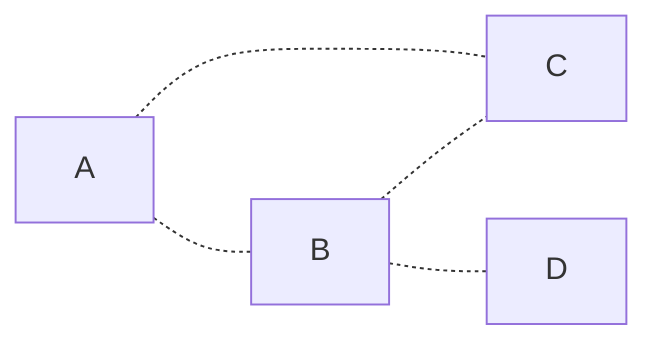
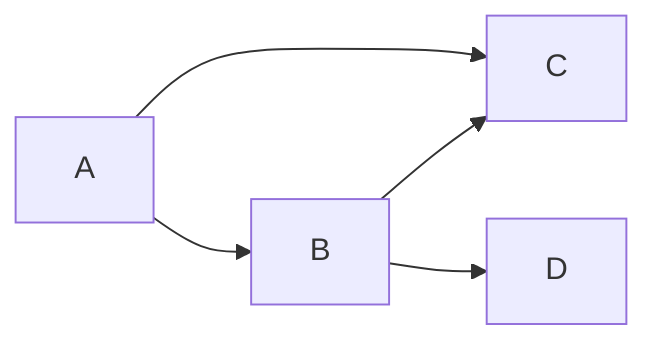
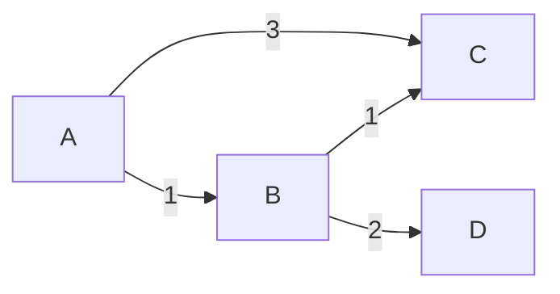
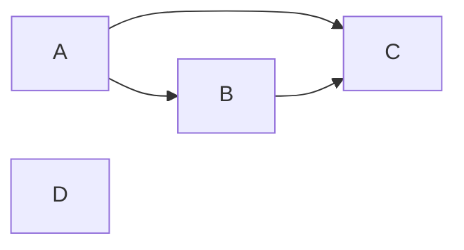
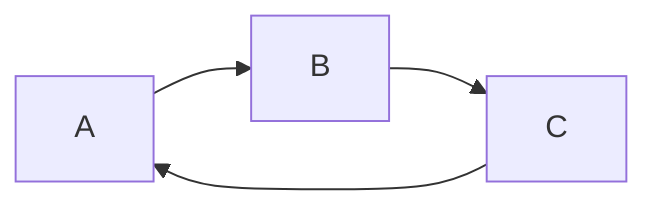
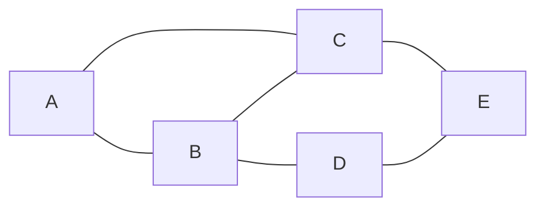
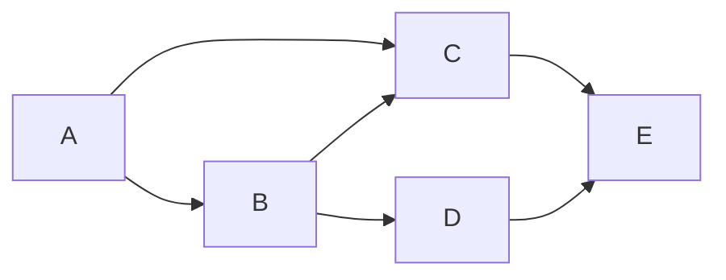
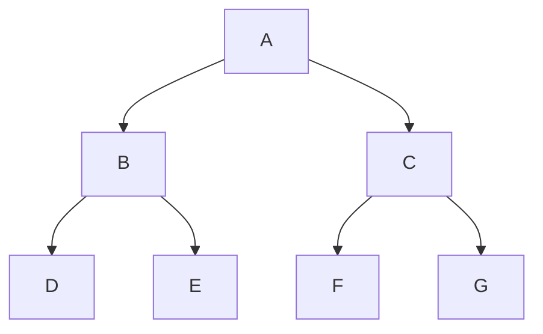
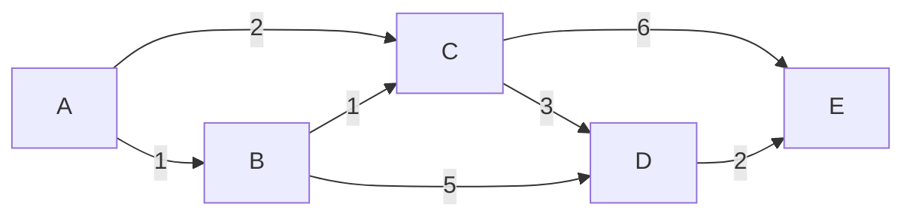

En informatique, il existe une grande famille de structures de données appelée **graphes**. C'est un outil très puissant qui permet de modéliser des problèmes très variés. Dans cette leçon, nous allons voir comment représenter un graphe en mémoire et comment parcourir un graphe.

## Quelques définitions

Un **graphe** est un ensemble de **sommets** reliés par des **arêtes**. On peut représenter un graphe par un ensemble de points reliés par des traits. Les points sont les sommets et les traits sont les arêtes.

Un graphe est dit **orienté** si les arêtes ont un sens. Dans ce cas, on parle d'**arc**. Un graphe est dit **non orienté** si les arêtes n'ont pas de sens.

Un graphe est dit **pondéré** si les arêtes ont un poids. Dans ce cas, on parle de **poids** d'une arête. Un graphe est dit **non pondéré** si les arêtes n'ont pas de poids.

Un graphe est dit **connexe** si tous les sommets sont reliés entre eux par une arête ou une suite d'arêtes.

Un graphe est dit **cyclique** si il contient au moins un cycle. Un cycle est une suite d'arêtes qui permet de revenir au point de départ.

### Les arbres

On a précédemment vu les **arbres binaires**. Un arbre n'est rien d'autre qu'un graphe particulier. Un arbre est un graphe **non orienté**, **non pondéré**, **connexe** et **acyclique**.

## Représentation d'un graphe

Il existe plusieurs manières de représenter un graphe en mémoire. Nous allons voir les deux plus courantes.

### Matrice d'adjacence

La première manière de représenter un graphe est d'utiliser une **matrice d'adjacence**. Une matrice d'adjacence est une matrice carrée dont les lignes et les colonnes représentent les sommets du graphe. Si le sommet $i$ est relié au sommet $j$, alors la case $(i,j)$ de la matrice vaut 1. Sinon, elle vaut 0. Si le graphe est pondéré, la case $(i,j)$ de la matrice vaut le poids de l'arête.

Voici un exemple de matrice d'adjacence pour un graphe non orienté et non pondéré :

|   | A | B | C | D | E |
|---|---|---|---|---|---|
| A | 0 | 1 | 1 | 0 | 0 |
| B | 1 | 0 | 1 | 1 | 0 |
| C | 1 | 1 | 0 | 0 | 1 |
| D | 0 | 1 | 0 | 0 | 1 |
| E | 0 | 0 | 1 | 1 | 0 |

Et le graphe correspondant :

Dans le cas d'un graphe orienté, la matrice n'est plus symétrique. Voici un exemple de matrice d'adjacence pour un graphe orienté et non pondéré :

|   | A | B | C | D | E |
|---|---|---|---|---|---|
| A | 0 | 1 | 1 | 0 | 0 |
| B | 0 | 0 | 1 | 1 | 0 |
| C | 0 | 0 | 0 | 0 | 1 |
| D | 0 | 0 | 0 | 0 | 1 |
| E | 0 | 0 | 0 | 0 | 0 |

Et le graphe correspondant :

### Liste d'adjacence

La deuxième manière de représenter un graphe est d'utiliser une **liste d'adjacence**. Une liste d'adjacence est une liste de listes. Pour chaque sommet, on a une liste des sommets adjacents. Si le graphe est pondéré, on a une liste des sommets adjacents avec leur poids (avec une paire par exemple).

Voici un exemple de liste d'adjacence pour un graphe non orienté et non pondéré :

| Sommet | Adjacents |
|--------|-----------|
| A      | B, C      |
| B      | A, C, D   |
| C      | A, B, E   |
| D      | B, E      |
| E      | C, D      |

En pratique, on utilise plutôt la **liste d'adjacence** pour représenter un graphe car la **matrice d'adjacence** peut être très coûteuse en mémoire. En effet, une matrice d'adjacence est une matrice carrée. Donc, si on a $n$ sommets, on a $n^2$ cases. Même si le graphe possède peu d'arêtes, la matrice d'adjacence est quand même de taille $n^2$. Cela peut être légèrement optimisé dans le cas des graphes non orientés car la matrice est symétrique. On peut donc ne stocker que la moitié de la matrice. Mais cela reste quand même très coûteux en mémoire.

L'utilité de la **matrice d'adjacence** est qu'elle permet de savoir si deux sommets sont reliés en **temps constant**. Dans les cas où c'est acceptable de stocker une matrice d'adjacence, on peut donc utiliser cette propriété pour gagner du temps. Cela a aussi des applications en théorie des graphes pour analyser des graphes.

## Parcours d'un graphe

Maintenant que nous avons vu comment représenter un graphe en mémoire, nous allons voir comment parcourir un graphe. Il existe principalement deux manières de parcourir un graphe : en **largeur** et en **profondeur**.

Donnons-nous le graphe suivant :

### Parcours en largeur

Le parcours en largeur consiste à parcourir le graphe en partant d'un sommet et en visitant tous les sommets adjacents avant de passer aux sommets adjacents de ces sommets adjacents. On visite donc les sommets par niveau.

Pour parcourir un graphe en largeur, on utilise une **file**. On commence par ajouter le sommet de départ dans la file. Tant que la file n'est pas vide, on retire le premier élément de la file et on l'ajoute à la liste des sommets visités. Ensuite, on ajoute tous les sommets adjacents de ce sommet dans la file. On recommence jusqu'à ce que la file soit vide.

Voici le déroulement du parcours en largeur au départ du nœud A pour le graphe précédent :

- On commence par ajouter le sommet **A** dans la file.

| File | A |
|------|---|

- Comme la file n'est pas vide, on retire le premier élément (**A**) de la file. On ajoute ensuite tous les sommets adjacents de ce sommet dans la file. On ajoute donc **B** et **C** dans la file.

| File | C | B |
|------|---|---|

- On retire le premier élément (**B**) de la file. On ajoute ensuite tous les sommets adjacents de ce sommet dans la file. On ajoute donc **D** et **E** dans la file.

| File | E | D | C |
|------|---|---|---|

- On retire le premier élément (**C**) de la file. On ajoute ensuite tous les sommets adjacents de ce sommet dans la file. On ajoute donc **F** et **G** dans la file.

| File | G | F | E | D |
|------|---|---|---|---|

- On retire le premier élément (**D**) de la file. On ajoute ensuite tous les sommets adjacents de ce sommet dans la file. On ajoute donc rien dans la file.

| File | G | F | E |
|------|---|---|---|

- On fait de même pour **E**, **F** et **G**. La file est maintenant vide. On a donc parcouru tous les sommets du graphe.

Cela nous donne donc le parcours suivant : **A, B, C, D, E, F, G**.

### Parcours en profondeur

Le parcours en profondeur consiste à parcourir le graphe en partant d'un sommet et en visitant ses sommets adjacents puis les sommets adjacents de ces sommets adjacents, etc. On visite donc les sommets en profondeur. On peut voir le parcours en profondeur comme une descente dans le graphe.

Pour parcourir un graphe en profondeur, on utilise une **pile**. On commence par ajouter le sommet de départ dans la pile. Tant que la pile n'est pas vide, on retire le premier élément de la pile et on l'ajoute à la liste des sommets visités. Ensuite, on ajoute tous les sommets adjacents de ce sommet dans la pile. On recommence jusqu'à ce que la pile soit vide.

Voici le déroulement du parcours en profondeur au départ du nœud **A** pour le graphe précédent :

- On commence par ajouter le sommet **A** dans la pile.

| Pile | A |
|------|---|

- Comme la pile n'est pas vide, on retire le premier élément (**A**) de la pile. On ajoute ensuite tous les sommets adjacents de ce sommet dans la pile (**B** et **C**).

| Pile | B | C |
|------|---|---|

- On retire le premier élément (**C**) de la pile. On ajoute ensuite tous les sommets adjacents de ce sommet dans la pile. On ajoute donc **F** et **G** dans la pile.

| Pile | B | F | G |
|------|---|---|---|

- On retire le premier élément (**G**) de la pile. On ajoute ensuite tous les sommets adjacents de ce sommet dans la pile. On ajoute donc rien dans la pile.

| Pile | B | F |
|------|---|---|

- On retire le premier élément (**F**) de la pile, il n'a pas de sommets adjacents. On ajoute donc rien dans la pile.

| Pile | B |
|------|---|

- On recommence avec **B**. On ajoute **D** et **E** dans la pile.

| Pile | D | E |
|------|---|---|

- On fait de même pour **E** et **D**. La pile est maintenant vide. On a donc parcouru tous les sommets du graphe.

Ce qui nous donne le parcours suivant : **A, C, G, F, B, E, D**.

## En pratique

Maintenant que nous avons vu ce qu'est un graphe il est légitime de se demander à quoi cela peut bien servir. En effet, on peut se demander si on a déjà rencontré des graphes dans la vie de tous les jours. La réponse est oui. Les graphes sont utilisés dans de nombreux domaines. En voici quelques exemples :

- Les réseaux sociaux : les graphes sont utilisés pour modéliser les relations entre les utilisateurs.
- Les jeux vidéos : les graphes sont utilisés pour modéliser les niveaux, les cartes ou encore pour de la recherche de chemin (intelligence artificielle des ennemis par exemple).
- Les bases de données : les graphes sont utilisés pour modéliser les relations entre les données.
- Les problèmes de transport : les graphes sont utilisés pour modéliser les réseaux de transport (routes, métro, etc.) et permettent de résoudre des problèmes d'optimisation (par exemple, trouver le plus court chemin entre deux villes).
- Des algorithmes de programmation dynamique : les graphes sont beaucoup utilisés dans les algorithmes dis de programmation **dynamique** où le problème est si complexe qu'il est nécessaire de le décomposer en sous-problèmes, de faire des estimations et d'explorer les solutions possibles à travers un graphe de solutions.

## Dijkstra

Je vous propose de voir un exemple d'algorithme de graphe : l'algorithme de **Dijkstra**. Cet algorithme permet de trouver le plus court chemin entre deux sommets d'un graphe **pondéré**. Il est très répandu et est utilisé dans de nombreux domaines.

L'algorithme de Dijkstra est simplement une application du parcours en largeur. On part d'un sommet de départ et on visite tous les sommets adjacents. On ajoute ensuite les sommets adjacents de ces sommets adjacents dans la file. On recommence jusqu'à ce qu'on ait trouvé le sommet d'arrivée. On peut alors remonter le chemin en partant du sommet d'arrivée et en remontant les sommets précédents jusqu'au sommet de départ.

Pour l'illustrer on peut prendre une liste de même taille que le nombre de sommets du graphe pour représenter les distances. On initialise toutes les distances à l'infini sauf la distance du sommet de départ qui est à 0. On utilise également une file pour stocker les sommets à visiter et une liste pour stocker les sommets déjà visités. On commence par ajouter le sommet de départ dans la file des sommets à visiter. Tant que la file n'est pas vide, on retire le premier élément de la file et on l'ajoute à la liste des sommets visités. Ensuite, on ajoute tous les sommets adjacents de ce sommet dans la file s'ils n'ont pas déjà été visités. Pour chaque sommet adjacent, on met à jour sa distance si la distance actuelle est plus grande que la distance du sommet actuel plus le poids de l'arête entre le sommet actuel et le sommet adjacent. On recommence jusqu'à ce que la file soit vide.

:::tip
Dans la pratique:
- On utilise une **file de priorité** `std::priority_queue` pour stocker les sommets à visiter. Cela permet de retirer le sommet avec la plus petite distance facilement et de manière efficace.

- On utilise un **tableau associatif** pour stocker les distances. Cela permet de ne pas avoir à créer une liste de taille fixe de tout les noeuds avec une distance infinie initialement. On peut simplement ajouter les distances au fur et à mesure que l'on parcourt le graphe et cela permet au passage de savoir quels noeuds ont déjà été visités sans avoir de liste de noeuds visités supplémentaire.
De plus, généralement, cet algorithme est utilisé pour trouver le plus court chemin entre deux sommets. On peut donc s'arrêter dès qu'on a trouvé le sommet d'arrivée.
:::

:::warning
L'algorithme de Dijkstra ne fonctionne que pour les graphes **pondérés positivement**. En effet, si le graphe contient des arêtes de poids négatif, l'algorithme peut boucler indéfiniment. Pour éviter ces problèmes,il est aussi possible d'utiliser une variante: l'algorithme de **Bellman-Ford** qui est plus lent mais qui fonctionne pour les graphes avec des cycles et des arêtes de poids négatif.
:::

Pour illustrer l'algorithme de Dijkstra, donnons-nous le graphe suivant :

L'idée de l'algorithme est de partir d'un sommet de départ que l'on ajoute à un ensemble de sommets à visiter (on va également noter la distance depuis le sommet de départ pour aller jusqu'à ce sommet (ce qui va permettre de prioriser les sommets à visiter)).

On va se servir d'un **tableau associatif** pour associer à chaque sommet visité la distance la plus courte connue pour aller du sommet de départ à ce sommet et d'où on vient pour atteindre cette distance (ce qui permet de reconstruire le chemin le plus court à la fin).
Cela permet au passage de marquer les sommets comme visités sans avoir de liste ou structure de données supplémentaire.

Ensuite on va **itérer** sur les sommets à visiter en choisissant à chaque fois le sommet le plus proche du sommet de départ. Pour cela, on va se servi d'une file de priorité `std::priority_queue` qui va nous permettre de choisir le sommet le plus proche à chaque itération.

Si le sommet choisi n'a pas encore été visité, on va le marquer comme visité (mettre à jour le tableau associatif) et on va ajouter à la liste des sommets à visiter tous les sommets voisins de ce sommet.

Si le sommet choisi a déjà été visité, on va regarder si la distance la plus courte connue pour aller à ce sommet (la valeur dans le **tableau associatif**) est plus grande en passant par le sommet choisi. Si c'est le cas, on va mettre à jour la distance la plus courte et le sommet d'où on vient pour atteindre cette distance et on va de nouveau ajouter le sommet à la liste des sommets à visiter car l'on a trouvé un chemin plus court pour y arriver, on dois propager cette information.

### Illustration de l'algorithme de Dijkstra

on considère que le sommet de départ est **A** et le sommet d'arrivée est **E**.

On ajoute le sommet `A` à la liste des sommets à visiter avec une distance de 0 (on est déjà sur le sommet de départ) et d'où on vient (on est déjà sur le sommet de départ).
| Distances | A visiter |
|:---------:|:---------:|
|     -     |   A(0)    |

Il reste des éléments dans la liste à visiter on récupère le sommet qui a la plus petite distance (**A**) et on le retire de la liste à visiter.
On parcours la liste des voisins de **A** (B et C), les deux ne sont pas déjà visités, on les ajoutes à la liste à visiter et au tableau associatif avec la distance en passant par **A** (0 + poids de l'arête) et d'où on vient (A).

|      Distances       |   A visiter    |
|:--------------------:|:--------------:|
| **B(1, A), C(2, A)** | **B(1), C(2)** |

Je récupère maintenant **B** qui est le sommet prioritaire dans la liste à visiter (plus petites distance).

Je parcours la liste des voisins de **B** (C et D). **C** est déjà présent dans le tableau associatif ce qui indique qu'il a déjà été visité ou marqué à visiter. Ici le poids actuellement dans le tableau des distances est égale au poids en passant par B (1 + 1) donc on ne fait rien les deux chemins sont aussi cours l'un que l'autre.

pour **D** on ajoute comme précédemment ce qui donne:

|           Distances           |   A visiter    |
|:-----------------------------:|:--------------:|
| B(1, A), C(2, A), **D(6, B)** | C(2), **D(6)** |

Je recommence de nouveau avec **C** qui est le sommet prioritaire dans la liste à visiter (plus petites distance).
**D** a déjà été visité **mais** ici le coût en passant par **C** est plus faible ($2 + 3 < 6$), je mets donc à jour la distance et je rajoute de nouveau **D** dans la liste à visiter:

|           Distances            |   A visiter    |
|:------------------------------:|:--------------:|
| B(1, A), C(2, A),  **D(5, C)** | D(6), **D(5)** |

:::note
Ici il y a deux fois **D** dans la liste, ce n'est pas grave car avec la priorité on va de toute façon choisir le plus petit. Puis au moment de traiter une deuxième fois **D** on va voir que la distance est plus grande et on ne va rien faire.
:::

Enfin on ajoute aussi **E** l'autre sommet adjacent à **C**:

|               Distances                |      A visiter       |
|:--------------------------------------:|:--------------------:|
| B(1, A), C(2, A), D(5, C), **E(8, C)** | D(6), D(5), **E(8)** |

Je continue avec **D** :

|               Distances                |        A visiter         |
|:--------------------------------------:|:------------------------:|
| B(1, A), C(2, A), D(5, C), **E(7, D)** | D(6), **E(8)**, **E(7)** |

De nouveau avec D car il était en doublon dans la liste mais cela ne va avoir aucun effet car E est listé avec un poids donc plus faible.

|               Distances                |     A visiter      |
|:--------------------------------------:|:------------------:|
| B(1, A), C(2, A), D(5, C), **E(7, D)** | **E(8)**, **E(7)** |

Enfin on récupère **E**, il n'a pas d'arrêtes donc on ne fait rien, mais c'est le sommet de destination on a atteins notre destination, on peut s'arrêter et retourner le tableau associatif.

On peut s'amuser à retrouver la succession des arrêtes à parcours grâce au tableau associatif: **A** $\rightarrow$ **C** $\rightarrow$ **D** $\rightarrow$ **E**.

:::note
Vous pouvez trouver une autre façon de représenter l'algorithme avec une liste de distances pour tout les sommets (initialisée à l'infini) et une liste de sommets visités. Néanmoins, cette méthode est plus coûteuse en mémoire et moins proche de l'implémentation de l'algorithme de Dijkstra. C'est pour cela que j'ai choisi de vous présenter cette illustration (avec un tableau associatif (Distances) et une file de priorité (A visiter)).
:::

### Pour aller plus loin: A*

L'algorithme de Dijkstra peut être amélioré. En effet, il explore tous les sommets adjacents d'un sommet avant de passer au sommet suivant. Cela peut être très coûteux en temps si le graphe est très grand et ou si le sommet de départ et le sommet d'arrivée sont très éloignés. L'algorithme de **Dijkstra** explore alors beaucoup de sommets inutilement.

L'algorithme A* est une amélioration de l'algorithme de **Dijkstra**. Il utilise une **heuristique** pour guider la recherche. L'**heuristique** est une fonction qui permet d'**estimer** la distance entre un sommet et le sommet d'arrivée. L'algorithme **A*** explore alors en priorité les sommets qui sont les plus proches(selon cette estimation) du sommet d'arrivée. Cela permet de réduire le nombre de sommets explorés et donc de gagner du temps.

Pour donner un exemple concret, on peut utiliser la **distance euclidienne** comme **heuristique**. La **distance euclidienne** est la distance à vol d'oiseau entre deux points. On peut l'utiliser pour guider la recherche dans un labyrinthe par exemple. On peut alors utiliser la **distance euclidienne** entre le sommet actuel et le sommet d'arrivée comme heuristique. Cela permet d'explorer en priorité les sommets qui sont les plus proches (à vol d'oiseau) du sommet d'arrivée.

## Simplification 2D

La représentation en liste d'adjacence est très pratique pour représenter un graphe arbitraire. Cependant, dans certains cas, on peut utiliser une représentation plus simple. C'est le cas par exemple quand on cherche le plus court chemin entre deux points dans une **grille**. Dans ce cas les sommets sont les centres des cases de la grille et les arêtes sont les côtés des cases de la grille. Il n'est alors pas nécessaire de stocker la représentation complète du graphe car celle-ci est connue à l'avance. On peut donc utiliser une représentation plus simple.

Dans le cas où le coup de déplacement d'une case à une autre est le même pour toutes les cases, appliquer **Dijkstra** sur une grille devient alors très simple. Il suffit de **parcourir** la grille **en largeur** en partant du point de départ et en s'arrêtant quand on a trouvé le point d'arrivée. On peut alors remonter le chemin en partant du point d'arrivée et en remontant les points précédents jusqu'au point de départ (parfois aussi nommé **Breadth First Search** ou **BFS**).

## Résumé

- Un **graphe** est un **ensemble** de **sommets** reliés par des **arêtes**.
- Un graphe est dit **orienté** si les **arêtes ont un sens**. Dans ce cas, on parle d'arc.
- Un graphe est dit **pondéré** si les **arêtes ont un poids**.
- Un graphe est dit **connexe** si **tous les sommets sont reliés entre eux** par une arête ou une suite d'arêtes.
- Un arbre est un graphe(Un graphe **non orienté**, **non pondéré**, **connexe** et **acyclique**)
- Il existe deux manières de représenter un graphe en mémoire : la **matrice d'adjacence** et la **liste d'adjacence**.
- Il existe deux manières de parcourir un graphe : en **largeur** et en **profondeur**.
- L'algorithme de **Dijkstra** permet de trouver les distances les plus courtes entre un sommet de départ et tous les autres sommets d'un graphe **pondéré positivement**.
- L'algorithme A* est une amélioration de l'algorithme de **Dijkstra** qui utilise une **heuristique** pour guider la recherche.
- Dans le cas d'un graphe non **pondéré**, **Dijkstra** n'est rien d'autre qu'un **parcours en largeur**.

## Sources

Voilà quelques sources qui peuvent vous aider à approfondir le sujet et mieux comprendre les graphes et la recherche de chemin :

- https://www.redblobgames.com/pathfinding/a-star/introduction.html
- https://www.youtube.com/watch?v=GazC3A4OQTE
- https://www.youtube.com/watch?v=i3_V90yUfcA
- https://www.youtube.com/watch?v=-L-WgKMFuhE
