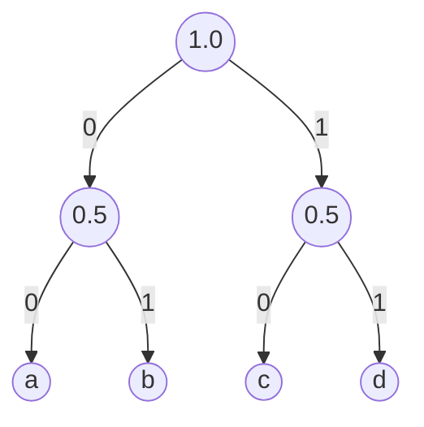
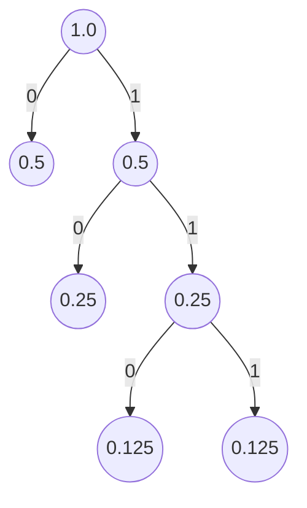

La compression de données est un domaine très vaste et très important en informatique. Il existe de nombreuses techniques de compression, qui sont utilisées dans de nombreux domaines : compression d'**images**, compression de **vidéos**, compression de **fichiers**, etc.

Dans ce cours nous allons voir découvrir des techniques de compression très répandue : 
- Le codage par plages (ou **run-length encoding**)
- le **codage de Huffman**

Nous allons voir comment ils fonctionnent, et comment les implémenter en C++.

## Compression de données

La compression de données est une technique qui permet de réduire la taille des données. Cela permet de stocker plus de données sur un support de stockage, ou de transmettre les données plus rapidement sur un réseau.

C'est un domaine crucial en informatique moderne. Sans la compression de données, il serait impossible de stocker des milliers de photos sur un téléphone portable, ou de regarder des vidéos en streaming sur Internet.

Il existe deux types de compression de données : la compression **avec perte** et la compression **sans perte**. La compression avec perte permet de réduire la taille des données, mais on ne garanti pas que les données décompressées seront identiques aux données d'origine. C'est le cas par exemple de la compression d'images au format **JPEG** où la perte de qualité est relativement maîtriser pour cela soit le moins perceptible par l'oeil humain. La compression sans perte permet de retrouver les données d'origine après les avoir décompressées. C'est le cas par exemple de la compression d'images au format **PNG**.

## Prérequis

Pour ce cours, il est nécessaire de connaître quelques notions de base sur la représentation des données en informatique. Voici un résumé des notions à connaître :

- Un **bit** est la plus petite unité de stockage en informatique. Il ne peut prendre que deux valeurs : 0 ou 1. Un **octet** est un groupe de **8 bits**. Il peut donc prendre 256 valeurs différentes (de 0 à 255).

- Chaque **donnée** peut être représentée par une **suite de bits.** Par exemple, le nombre 42 peut être représenté en binaire par la suite de bits `101010`. Avec un octet, on peut représenter au maximum 256 nombres différents.

- Un **caractère** est généralement codé sur un octet (cela peut dépendre de l'encodage utilisé). Cela signifie que l'on peut représenter 256 caractères différents. Cela inclut les **lettres** de l'alphabet, les **chiffres**, les caractères spéciaux, etc.

## Encodage et représentation des données

Un encodage est une manière de représenter les données. Par exemple, on peut représenter le nombre 42 de la manière suivante : `101010`. C'est un encodage **binaire**. On peut aussi représenter le nombre 42 de la manière suivante : `2A`. C'est un encodage hexadécimal. 

Encoder des données revient à associer à chaque donnée un **code**.

Dans la suite de ce cours nous allons nous intéresser à l'encodage binaire. C'est l'encodage utilisé par les ordinateurs et qui permet de représenter les données de manière la plus compacte possible. C'est aussi l'encodage utilisé par les algorithmes de compression.

---

Dans un fichier texte, chaque lettre est représentée par un **caractère**. Ce caractère est généralement encodé sur un **octet**. Cela signifie que l'on peut représenter 256 caractères différents. Cela inclut les lettres de l'alphabet, les chiffres, les caractères spéciaux, etc.

Mais cela dépend des données du problèmes. Cet encodage sur un octet est simplement une convention. Qui permet d'associer à chaque caractère un code unique et d'uniformiser la manière dont les caractères sont représentées (chaque caractère est représenté par un octet). C'est bien pratique et flexible pour communiquer des fichiers texte entre ordinateurs.

### Compression

Mais généralement lorsqu'il s'agit de compresser des données, les données du problème sont plus **simples**. Par exemple on pourrait se limiter aux **lettres de l'alphabet**. Dans ce cas, avoir un octet pour représenter chaque lettre est une perte d'espace. En effet, on pourrait se contenter de 5 bits pour représenter les 26 lettres de l'alphabet. Cela permettrait de réduire la taille du texte de 37.5% !

:::info
Plus généralement, si on se limite à `n` possibilités de données et que l'on souhaite utiliser un encodage avec le même nombre de bits pour chaque donnée, il faut $\lceil \log_2(n) \rceil$ bits pour représenter chaque donnée.
Par exemple, si on se limite aux **26** lettres de l'alphabet, il faut $\lceil \log_2(26) \rceil = \lceil 4.7 \rceil = 5$ bits pour représenter chaque lettre.
:::

De plus pour n'importe quel façon d'encoder les données, il faut respecter deux règles pour que l'encodage puisse être décodé :
  - Chaque donnée doit être associée à un code **unique**
  - Il ne doit pas y avoir d'**ambiguïté** lors du décodage des données. Cela signifie qu'il ne faut pas associer à une donnée le code `01` et à une autre donnée le code `011` sinon impossible de savoir si l'on doit décoder les deux premiers bits `01` ou si cela faisait en fait partie du code `011`. Un tel codage sans ambiguïté est appelé **préfixe**, nous y reviendrons plus tard.

## Codage par plages (Run-Length Encoding)

Le codage par plages est une technique de compression **sans perte**. Cela signifie que l'on peut retrouver les données d'origine après les avoir décompressées. Elle est très utilisée pour compresser des images, comme par exemple les images au format **BMP** ou **JPEG**.

Le principe du codage par plages est de tenir compte de la **répétition** des données. Admettons que l'on ait un texte de 8 caractères, composé uniquement de la lettre `a` : `aaaaaaaa`.
Si l'on veut stocker ce texte sur un support de stockage, il faudra donc **8 octets** pour le stocker (1 octet par caractère).

Mais si l'on tient compte du fait que le texte est composé uniquement de la lettre `a`, on peut le représenter de la manière suivante : `8a`.

On peut donc stocker ce texte sur un support de stockage en utilisant seulement 2 octets. Cela permet de réduire la taille du texte de 75% !

C'est le principe du codage par plages : on remplace une suite de caractères identiques par le nombre de fois que le caractère est répété, suivi du caractère. Par exemple, le texte suivant `aaaabbbcddddd` peut être représenté par `4a3b1c5d`. Pour un gain de 13-8=5 octets, soit 38% de gain.

:warning: Quand il y a peu de répétitions cependant le codage par plages peut augmenter la taille des données. Par exemple, Si on applique le codage par plage sur le texte suivant `abcdefgh` on obtient `1a1b1c1d1e1f1g1h`. Cela prend plus de place que la chaîne d'origine !
Dans ce cas de figure, pour minimiser cet effet, on choisi plutôt d'ajouter un **caractère de contrôle** et un nombre `n` pour indiquer que les `n` prochains caractères ne sont pas compressés. Par exemple, on pourrait utiliser le caractère `*` comme caractère de contrôle et la chaîne `abcdefgh` serait compressée en `*8abcdefgh`.

### En pratique

L'encodage **RLE** peut être exprimé de multiples façons en pratique pour tenir compte des propriétés des données ainsi que d'algorithmes de compression supplémentaires. Cela permet de compresser les données seulement lorsque cela est nécessaire et de laisser la chaîne telle quelle lorsque la compression induit un gaspillage.

Par exemple on pourrait se donner les règles suivantes :
- Lorsque trois éléments ou plus se répètent consécutivement alors la méthode de compression RLE est utilisée. On insère alors le nombre d'éléments répétés, suivi du caractère répété.
- Sinon un caractère de contrôle (*) est inséré, suivi du nombre d'éléments de la chaîne non compressée puis de cette dernière.

Ainsi la chaîne `aaaabccdeeeeefgh` serait compressée en `4a*4bccd5e*3fgh` et la chaîne `abcdefgh` serait compressée en `*8abcdefgh`.

On pourrait aussi plutôt se dire que l'on utilise le caractère de contrôle pour indiquer que la chaîne est compressée. Dans ce cas, la chaîne `aaaabccdeeeeefgh` serait compressée en `*4abccd*5efgh`.

Enfin on pourrait aussi se dire que l'on utilise le caractère lui même comme caractère de contrôle. de sorte que chaque fois qu'un caractère apparaît deux fois, il indique une longueur d'exécution. Dans l'exemple précédent, cela donnerait pour la chaîne `aaaabccdeeeeefgh` l'encodage `aa4bcc1dee5fgh`.

### Dans les images

Dans les images il est courant de trouver des zones de couleurs uniformes. Par exemple, une image de ciel bleu peut être représentée par une suite de pixels bleus. Dans ce cas, le codage par plages permet de réduire considérablement la taille de l'image.

Il existe donc des variantes pour parcourir les pixels d'une image dans un certains sens pour maximiser les zones de couleurs uniformes (ou de valeurs identiques). Par exemple, on peut parcourir les pixels de gauche à droite, de haut en bas ou même encore en zigzag.

## Codage de Huffman

Le codage de Huffman est aussi une technique de compression **sans perte**. C'est une technique très utilisée pour compresser des fichiers, comme par exemple des fichiers texte. Cette technique est utilisée par de nombreux formats de fichiers, comme par exemple le format **JPEG** pour les images.

Par exemple, si on se limite aux quatre lettres `a`, `b`, `c` et `d` (on a donc besoin seulement de 2 bits pour coder chaque lettre
).
Voilà un encodage possible :

- `a` est codé sur `00`
- `b` est codé sur `01`
- `c` est codé sur `10`
- `d` est codé sur `11`

Le texte `abbacada` peut donc être représenté par `0001010010001100`.
C'est déjà mieux que l'encodage ASCII, qui utilise 8 bits pour coder chaque lettre. On se limite à des données particulières, et on utilise un encodage plus compact.

Mais on peut faire mieux !

### Fréquence d'apparition des données

Le principe du codage de Huffman est de tenir compte de la **fréquence d'apparition** des données.

Pour un texte composé de 100 caractères (toujours avec notre alphabet de 4 lettres) il faudra donc 200 bits pour le représenter.

Dans le cas de notre exemple précédent `abbacada`, on peut remarquer que la lettre `a` apparaît **4** fois, la lettre `b` apparaît **2** fois et les lettres `c` et `d` apparaissent **1** fois. On peut donc se demander si l'on ne pourrait pas utiliser un encodage différent pour chaque lettre, en tenant compte de la fréquence d'apparition de chaque lettre. Cela permettrait de réduire la taille du texte.

on pourrait donc utiliser moins d'un octet pour coder les lettres les plus utilisées, et plus d'un octet pour coder les lettres les moins utilisées. Cela permettrait de réduire la taille du texte.

Admettons que l'on code les lettres de la manière suivante :

- `a` est codé sur `0`
- `b` est codé sur `10`
- `c` est codé sur `110`
- `d` est codé sur `111`

:::note
J'ai fait attention à ce que chaque code soit **préfixe**. Cela signifie qu'il n'y a pas de code qui est préfixe d'un autre code. Cela permet de décoder les données sans ambiguïté.
:::

Le texte `abbacada` peut donc être représenté par `01010011001110` (soit 14 bits). C'est mieux que l'encodage précédent, qui utilisait 16 bits.

Mais comment faire pour trouver le meilleur encodage possible ?

### Arbre binaire

Dans la suite de ce cours, nous allons utiliser un **arbre binaire** (strict) pour trouver l'encodage de Huffman (en fonction de la fréquence d'apparition des données). Mais j'aimerai d'abord vous expliquer pourquoi on utilise un arbre binaire.

:::note
Dans un arbre binaire strict (ou localement complet), chaque noeud a soit 0, soit 2 fils. C'est donc soit un noeud **interne** (qui a deux fils), soit une **feuille** (qui n'a pas de fils).
:::

Chaque feuille de l'arbre va permettre de représenter une donnée. Par exemple, on peut représenter les lettres `a`, `b`, `c` et `d` de la manière suivante :

Une propriété intéressante des arbres binaires est que pour chaque feuille il existe un **chemin unique** de la racine à la feuille. Ce chemin va permettre d'associer un code à chaque donnée. En plus d'être unique, ce chemin est aussi **préfixe**. Cela signifie que l'on ne peut pas avoir un chemin qui est préfixe d'un autre chemin.

Reprenons notre exemple précédent avec les lettres `a`, `b`, `c` et `d`. Admettons que les quatre lettres apparaissent avec la même fréquence. 

Dans cet arbre, si l'on parcourt le chemin `0-0` (successivement le fils gauche puis le fils gauche), on arrive à la lettre `a`. De même pour les autres feuillets. On peut donc associer à chaque lettre un code unique :
- `a` est codé sur `00`
- `b` est codé sur `01`
- `c` est codé sur `10`
- `d` est codé sur `11`

On retrouve bien l'encodage que l'on avait utilisé précédemment dans le cas de données équiprobables.

### Algorithme

Revenons maintenant à notre cas avec des données non équiprobables. Admettons que l'on ait le texte suivant : `abbacada`. On peut calculer la fréquence d'apparition de chaque lettre :

| Lettre | Fréquence    |
|--------|--------------|
| a      | $4/8 = 0.5$  |
| b      | $2/8 = 0.25$ |
| c      | $1/8 = 0.125$|
| d      | $1/8 = 0.125$|

On peut remarquer qu'ne utilisant une représentation en arbre binaire complet, les lettres les **moins fréquentes** seront codées sur des codes plus gros (chemins les plus longs dans l'arbre) et donc sur les feuilles les plus basses de l'arbre. Les lettres les **plus fréquentes** seront codées sur des codes plus petits (chemins les plus courts dans l'arbre) et donc sur les feuilles les plus hautes de l'arbre.

---

C'est donc en suivant cette logique que l'on va construire l'arbre binaire. On va commencer par construire un arbre binaire avec les lettres les moins fréquentes.

On va donc commencer par construire un arbre binaire avec les lettres `c` et `d`. On va donc créer un noeud `cd` qui va avoir deux fils `c` et `d`. On va associer à chaque noeud la somme des fréquences de ses fils. On va donc associer à `cd` la fréquence `0.125 + 0.125 = 0.25`.

On va considérer maintenant que `cd` est un substitut aux lettres `c` et `d` et représente donc une seule donnée avec un fréquence de `0.25`.

Je vais appelé ce regroupement de données un **symbole**. Un symbole est donc une donnée qui peut être composée de plusieurs données. Par exemple, le symbole `cd` est composé des données `c` et `d`.

On va donc construire un arbre binaire avec les lettres `b` et `cd` (qui sont les deux symboles les moins fréquents parmi `a`, `b` et `cd`). On va donc créer un noeud `bcd` qui va avoir deux fils `b` et `cd`.

En répétant cette opération, on va finir par n'avoir plus que deux symboles : `a` et `bcd`. Cela va conduire à créer l'arbre final qui contient tous les lettres initiales.

Cela nous donne finalement l'arbre suivant:

Ce qui peux se traduire par l'encodage suivant :
- `a`: `0`
- `b`: `10`
- `c`: `110`
- `d`: `111`

On retrouve bien l'encodage que j'avais proposé précédemment.

Mathématiquement, on peut démontrer que l'encodage de Huffman est optimal. Cela signifie que l'encodage de Huffman permet de compresser les données de manière optimale.

:::note
En pratique, pour pouvoir décoder les données, il faut stocker l'arbre binaire quelque part. Cela peut être fait de différentes manières. Par exemple, on peut stocker l'arbre binaire dans le fichier compressé. 
Cela ajout un peu de poids au fichier compressé, mais cela permet de décoder les données ce qui est tout de même pratique :smiley:.
:::

## Résumé

- La compression de données permet de réduire la taille des données. Cela permet de stocker plus de données sur un support de stockage, ou de transmettre les données plus rapidement sur un réseau.
- Il existe deux types de compression de données : la compression **avec perte** et la compression **sans perte**.
- L'encodage est le fait d'associer à chaque donnée un **code**.
- Le codage par plages (**RLE**) est une technique de compression **sans perte** et consiste à remplacer une suite de caractères identiques par le nombre de fois que le caractère est répété, suivi du caractère.
- Le codage de Huffman est une technique de compression **sans perte** et consiste à tenir compte de la **fréquence d'apparition** des données. Chaque donnée est associée à un code **unique** et **préfixe**. L'encodage de Huffman est optimal. On peut construire l'encodage de Huffman en utilisant un arbre binaire complet.
- Un code préfixe est un code dans lequel aucun code n'est préfixe d'un autre code. Cela permet de décoder les données sans ambiguïté.

## Sources

- Super vidéo sur la théorie de l'information et l'encodage de Huffman : https://www.youtube.com/watch?v=B3y0RsVCyrw

