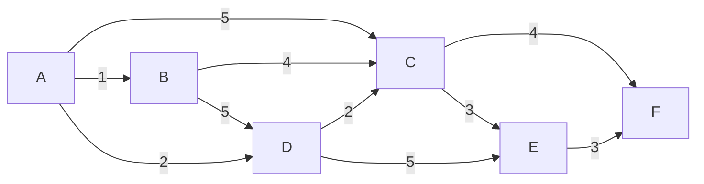

Pour ce TD, nous allons travailler sur les graphes. Les graphes peuvent être représentés de différentes manières. Nous allons travailler principalement avec une représentation sous forme de **liste d'adjacence** et d'un graphe pondéré et orienté plus intéressant pour les algorithmes de plus court chemin.

Je vous donne les structures suivantes pour représenter un graphe ainsi que les méthodes et fonctions que l'on va implémenter:

```cpp
#include <vector>
#include <unordered_map>
#include <utility>

namespace Graph {
    struct WeightedGraphEdge {
        int to {};
        float weight {1.0f};

        // default ici permet de définit les opérateurs de comparaison membres à membres automatiquement
        // Cela ne fonction qu'en C++20, si vous n'avez pas accès à cette version je vous donne les implémentations des opérateurs plus bas
        bool operator==(WeightedGraphEdge const& other) const = default;
        bool operator!=(WeightedGraphEdge const& other) const = default;
    };

    struct WeightedGraph {
        // L'utilisation d'un tableau associatif permet d'avoir une complexité en O(1) pour l'ajout et la recherche d'un sommet. Cela permet de stocker les sommets dans un ordre quelconque (et pas avoir la contrainte d'avoir des identifiants (entiers) de sommets consécutifs lors de l'ajout de sommets). Cela permet également de pouvoir utiliser des identifiants de sommets de n'importe quel type (string, char, int, ...) et pas seulement des entiers
        std::unordered_map<int, std::vector<WeightedGraphEdge>> adjacency_list {};

        void add_vertex(int const id);

        void add_directed_edge(int const from, int const to, float const weight = 1.0f);
        void add_undirected_edge(int const from, int const to, float const weight = 1.0f);
        
        // Même fonctionnement que pour WeightedGraphEdge
        bool operator==(WeightedGraph const& other) const = default;
        bool operator!=(WeightedGraph const& other) const = default;

        void print_DFS(int const start) const;
        void print_BFS(int const start) const;
    };

    WeightedGraph build_from_adjacency_matrix(std::vector<std::vector<float>> const& adjacency_matrix);

} // namespace
```

:::info Opérateurs de comparaison
Pour se simplifier la vie ici car c'est des structures simples et que l'on souhaite une égalité membres à membres, on peut utiliser le **C++20** et le mot clé `défault` ici.

Il faut indiquer la version dans le fichier `CMakeLists.txt` pour utiliser le C++20 en ajoutant la ligne suivante:
```cmake
set(CMAKE_CXX_STANDARD 20)
```
ou alors pour une target spécifique:
```cmake
target_compile_features(${TARGET_NAME} PUBLIC cxx_std_20)
```

Il faut ajouter à droite de la définition du prototype (dans le header directement) `= default;` comme je vous le fourni. Un exemple ici: [Defaulted equality comparison](https://en.cppreference.com/w/cpp/language/default_comparisons#:~:text=Defaulted%20equality%20comparison).

Si vous n'avez pas accès à cette version, je vous donne les implémentations des opérateurs de comparaison à ajouter dans le fichier source (`.cpp`):

```cpp
namespace Graph {
    bool WeightedGraphEdge::operator==(WeightedGraphEdge const& other) const {
        return to == other.to && weight == other.weight;
    }
    bool WeightedGraphEdge:: operator!=(WeightedGraphEdge const& other) const {
        return !(*this == other);
    }

    bool WeightedGraph::operator==(WeightedGraph const& other) const {
        return adjacency_list == other.adjacency_list;
    }

    bool WeightedGraph::operator!=(WeightedGraph const& other) const {
        return !(*this == other);
    }
} // namespace
```
:::

## Exercice 1 (construire un graphe)

1. Implémenter la méthode `add_vertex` qui prend en paramètre un identifiant de sommet et ajoute un sommet au graphe si il n'existe pas déjà. Il faut donc tester si le sommet existe déjà avant de créer la liste des edges. (vous pouvez utiliser la méthode [`find`](https://cplusplus.com/reference/unordered_map/unordered_map/find) de `std::unordered_map` pour cela).

2. Implémenter la méthode `add_directed_edge` qui ajoute une arrête dans le graphe en prenant en paramètre les IDs des deux noeuds à connecter (source vers destination) et le poids de l'arrête.
:::note
Si le noeuds de destination n'existe pas (comme clé du tableau associatif `adjacency_list`) il est possible et recommandé de l'ajouter au passage (en utilisant add_vertex). Ainsi, tout les sommets du graphe sont ajoutés automatiquement lors de l'ajout d'une arrête.
:::

3. Implémenter la méthode `add_undirected_edge` en utilisant `add_directed_edge` pour ajouter deux edges dans les deux sens pour connecter deux noeuds passés en paramètre.

4. De même, ajouter les opérateurs de comparaison pour la structure `WeightedGraph` (cela va permettre de vérifier si la fonction de la question suivante fonctionne bien en comparants les listes d'adjacences de deux graphes).

5. Implémenter la fonction `adjacency_list_from_adjacency_matrix` qui prend en paramètre une **matrice d'adjacence** (sous la forme d'un vecteur de vecteurs d'entiers) et qui retourne un graphe.

6. Écrire dans la fonction `main` un exemple d'utilisation de la fonction `adjacency_list_from_adjacency_matrix` pour créer un graphe à partir d'une matrice d'adjacence et créer un deuxième graphe en utilisant les méthodes `add_vertex` et `add_undirected_edge` pour ajouter les mêmes sommets et les mêmes arrêtes que dans le premier graphe. Ensuite, comparer les deux graphes pour vérifier qu'ils sont égaux.

## Exercice 2 (traverser un graphe)

1. Implémenter la méthode `print_DFS` qui prend en paramètre l'id du sommet de départ et qui affiche les sommets du graphe en utilisant un parcours en profondeur (DFS) à partir du sommet de départ (`depth-first search`).

2. Implémenter la méthode `print_BFS` qui utilise cette fois-ci un parcours en largeur (BFS) à partir du sommet de départ (`breadth-first search`).

3. Bonus : Implémenter le parcours en profondeur (BFS) à prenant en paramètre une fonction de **callback** pour chaque sommet visité. L'idée est de ne pas contraindre l'utilisateur à afficher les sommets mais de lui donner la possibilité de faire ce qu'il veut avec les sommets visités.
Voilà la signature de la méthode à implémenter:
```cpp
void DFS(int const start, std::function<void(int const)> const& callback) const;
```

`std::function` (`#include <functional>`) est un objet qui peut "stocker" n'importe quelle fonction qui a la même signature que celle donnée en paramètre (entre  <kbd> < </kbd> et <kbd> > </kbd>). Cela permet de passer une fonction en paramètre d'une autre fonction. C'est très utile pour faire des fonctions génériques qui peuvent être utilisées de différentes manières. On peut passer en paramètre une fonction définit dans le code ou une fonction **lambda** (une fonction anonyme) qui est définie directement dans le code. C'est comme cela que fonctionne les fonctions `std::sort`, `std::find_if`, `std::accumulate`, ... de la STL.

Voilà à quoi ressemble l'appel de cette méthode avec une fonction **lambda** qui affiche les sommets visités (pour reproduire le comportement de la méthode `print_DFS`):
```cpp
std::cout << "DFS from node 0:" << std::endl << "Visited nodes: ";
graph.DFS(0, [](int const node_id) { std::cout << node_id << " "; });
std::cout << std::endl;
```

## Dijkstra: algorithme de plus court chemin

L'algorithme de Dijkstra permet de trouver le plus court chemin entre un sommet de départ et un sommet d'arrivée dans un graphe pondéré.

Je vous invite à relire l'explication du cours [ici](/Lessons/S2/graphs#dijkstra);

1. Donnons nous le graphe suivant:



Écrivez les différentes étapes de l'algorithme de Dijkstra selon le même modèle que [l'illustration du cours](/Lessons/S2/graphs#illustration-de-lalgorithme-de-dijkstra) pour trouver le plus court chemin entre le sommet `A` et le sommet `E`.


1. (BONUS) En se donnant un bout de code pour démarrer l'implémentation de l'algorithme de Dijkstra, complétez le code pour implémenter l'algorithme de Dijkstra.
2. (BONUS) Testez votre implémentation avec le graphe donné en exemple pour trouver le plus court chemin entre le sommet `A` et le sommet `E`.
```cpp
std::unordered_map<int, std::pair<float, int>> dijkstra(WeightedGraph const& graph, int const& start, int const end) {
    // On crée un tableau associatif pour stocker les distances les plus courtes connues pour aller du sommet de départ à chaque sommet visité
    // La clé est l'identifiant du sommet et la valeur est un pair (distance, sommet précédent)
    std::unordered_map<int, std::pair<float, int>> distances {};

    // On crée une file de priorité pour stocker les sommets à visiter
    // la pair contient la distance pour aller jusqu'au sommet et l'identifiant du sommet

    // Ce type compliqué permet d'indiquer que l'on souhaite trier les éléments par ordre croissant (std::greater) et donc les éléments les plus petits seront au début de la file (top) (Min heap)
    std::priority_queue<std::pair<float, int>, std::vector<std::pair<float, int>>, std::greater<std::pair<float, int>>> to_visit {};

    // 1. On ajoute le sommet de départ à la liste des sommets à visiter avec une distance de 0 (on est déjà sur le sommet de départ)
    
    // Tant qu'il reste des sommets à visiter
    while (!to_visit.empty()) {
        // 2. On récupère le sommet le plus proche du sommet de départ dans la liste de priorité to_visit

        // 3.Si on atteins le point d'arrivé, on s'arrête
        if (/* TODO */) {
            return distances;
        }
        // 3. On parcoure la liste des voisins (grâce à la liste d'adjacence) du noeud courant
        for (/* TODO */) {
            // 4. on regarde si le noeud existe dans le tableau associatif (si oui il a déjà été visité)

            auto find_node { /* TODO */ };
            bool const visited { /* TODO */ };

             if (!visited) {
                    // 5. Si le noeud n'a pas été visité, on l'ajoute au tableau associatif en calculant la distance pour aller jusqu'à ce noeud
                    // la distance actuelle + le point de l'arrête)

                    // 6. On ajout également le noeud de destination à la liste des noeud à visité (avec la distance également pour prioriser les noeuds les plus proches)
                }else {
                    // 7. Si il a déjà été visité, On test si la distance dans le tableau associatif est plus grande
                    // Si c'est le cas on à trouvé un plus court chemin, on met à jour le tableau associatif et on ajoute de nouveau le sommet de destination dans la liste à visité
                    if (/* TODO */) {
                        
                    }
                } 
        }
    }

    return distances;
}
```