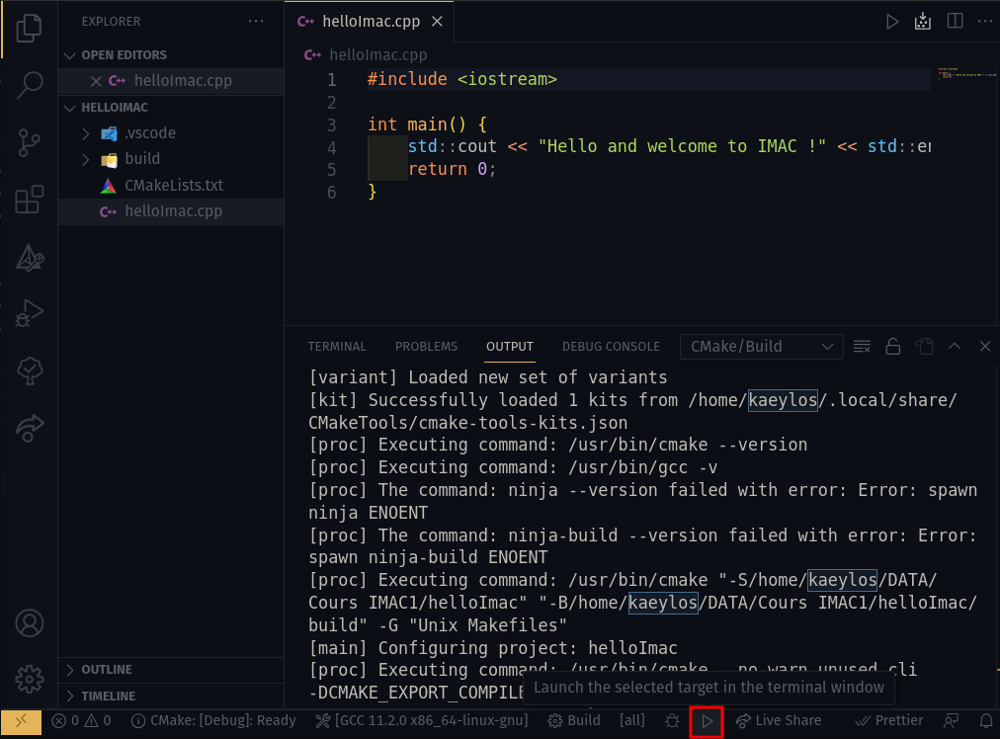

<style>

h1 {
    text-align: start;
    font-size: 1.75em;
}

section {
  font-family: Verdana, sans-serif;
}

img[alt~="center"] {
  display: block;
  margin: 0 auto;
}

blockquote {
  background: #16304C;
  border-left: 10px solid #3C74B0;
  margin: 1.5em 10px;
  padding: 0.5em 10px;
  color: #FFFFFF;
}

</style>

# Programmation et Algorithmique S1

## Enguerrand DE SMET (IMAC 2021 - IMAC "6")

---

# Programmation et Algorithmique S1

- Pas besoin de connaissances préalables
- CM: 10 séances
- TD: 10 séances (non notées)
- Examen: 1 séance (~ 1h30 - noté)
- Workshop: 1 semaine (noté)

---

# C++

## Un peu d'histoire

- C (1970) -> C++ (1980)
- Normalisation (1998)
- C++ moderne (C++11 - 2011)
- C++14, **C++17**, C++20, C++23...

---

# C++

## Pourquoi apprendre le C++ ?

- popularité
- rapidité (langage compilé)
- ancienneté
- modernisation (C++11)

---

# C++

## Langage difficile ?

- héritage du C
- complexité
- mise en place et écosystème

---

# Mise en place

- <svg role="img" viewBox="0 0 24 24" xmlns="http://www.w3.org/2000/svg" width ="50px">
  <title>Visual Studio Code</title><path fill="#fff" d="M23.15 2.587L18.21.21a1.494 1.494 0 0 0-1.705.29l-9.46 8.63-4.12-3.128a.999.999 0 0 0-1.276.057L.327 7.261A1 1 0 0 0 .326 8.74L3.899 12 .326 15.26a1 1 0 0 0 .001 1.479L1.65 17.94a.999.999 0 0 0 1.276.057l4.12-3.128 9.46 8.63a1.492 1.492 0 0 0 1.704.29l4.942-2.377A1.5 1.5 0 0 0 24 20.06V3.939a1.5 1.5 0 0 0-.85-1.352zm-5.146 14.861L10.826 12l7.178-5.448v10.896z"/></svg> IDE (Visual Studio code, XCode, CLion, ...)
- <svg role="img" viewBox="0 0 24 24" xmlns="http://www.w3.org/2000/svg" width ="50px"><title>Visual Studio</title><path fill="#fff" d="M17.583.063a1.5 1.5 0 00-1.032.392 1.5 1.5 0 00-.001 0A.88.88 0 0016.5.5L8.528 9.316 3.875 5.5l-.407-.35a1 1 0 00-1.024-.154 1 1 0 00-.012.005l-1.817.75a1 1 0 00-.077.036 1 1 0 00-.047.028 1 1 0 00-.038.022 1 1 0 00-.048.034 1 1 0 00-.03.024 1 1 0 00-.044.036 1 1 0 00-.036.033 1 1 0 00-.032.035 1 1 0 00-.033.038 1 1 0 00-.035.044 1 1 0 00-.024.034 1 1 0 00-.032.05 1 1 0 00-.02.035 1 1 0 00-.024.05 1 1 0 00-.02.045 1 1 0 00-.016.044 1 1 0 00-.016.047 1 1 0 00-.015.055 1 1 0 00-.01.04 1 1 0 00-.008.054 1 1 0 00-.006.05A1 1 0 000 6.668v10.666a1 1 0 00.615.917l1.817.764a1 1 0 001.035-.164l.408-.35 4.653-3.815 7.973 8.815a1.5 1.5 0 00.072.065 1.5 1.5 0 00.057.05 1.5 1.5 0 00.058.042 1.5 1.5 0 00.063.044 1.5 1.5 0 00.065.038 1.5 1.5 0 00.065.036 1.5 1.5 0 00.068.031 1.5 1.5 0 00.07.03 1.5 1.5 0 00.073.025 1.5 1.5 0 00.066.02 1.5 1.5 0 00.08.02 1.5 1.5 0 00.068.014 1.5 1.5 0 00.075.01 1.5 1.5 0 00.075.008 1.5 1.5 0 00.073.003 1.5 1.5 0 00.077 0 1.5 1.5 0 00.078-.005 1.5 1.5 0 00.067-.007 1.5 1.5 0 00.087-.015 1.5 1.5 0 00.06-.012 1.5 1.5 0 00.08-.022 1.5 1.5 0 00.068-.02 1.5 1.5 0 00.07-.028 1.5 1.5 0 00.09-.037l4.944-2.377a1.5 1.5 0 00.476-.362 1.5 1.5 0 00.09-.112 1.5 1.5 0 00.004-.007 1.5 1.5 0 00.08-.125 1.5 1.5 0 00.062-.12 1.5 1.5 0 00.009-.017 1.5 1.5 0 00.04-.108 1.5 1.5 0 00.015-.037 1.5 1.5 0 00.03-.107 1.5 1.5 0 00.009-.037 1.5 1.5 0 00.017-.1 1.5 1.5 0 00.008-.05 1.5 1.5 0 00.006-.09 1.5 1.5 0 00.004-.08V3.942a1.5 1.5 0 000-.003 1.5 1.5 0 000-.032 1.5 1.5 0 00-.01-.15 1.5 1.5 0 00-.84-1.17L18.206.21a1.5 1.5 0 00-.622-.146zM18 6.92v10.163l-6.198-5.08zM3 8.574l3.099 3.427-3.1 3.426z"/></svg> Compilateur (GCC, MSVC, Clang, ...)
- <svg role="img" viewBox="0 0 24 24" xmlns="http://www.w3.org/2000/svg" width ="50px"><title>CMake</title><path fill="#fff" d="M11.769.066L.067 23.206l12.76-10.843zM23.207 23.934L7.471 17.587 0 23.934zM24 23.736L12.298.463l1.719 19.24zM12.893 12.959l-5.025 4.298 5.62 2.248z"/></svg> Outil de compilation (CMake, Make, ...)

---

# Premiers programme

```cpp
#include <iostream>

int main()
{
    std::cout << "Hello and welcome to IMAC !" << std::endl;
    return 0;
}
```

- ```cl helloImac.cpp``` / ```g++ helloImac.cpp -o helloImac```


---

# Utiliser CMake et VSCode

```cmake title="CMakeLists.txt"
# Nous voulons un cmake "récent" pour utiliser les dernières fonctionnalités
cmake_minimum_required(VERSION 3.0)

# La version du C++ que l'on souhaite utiliser (dans notre cas C++17)
set(CMAKE_CXX_STANDARD 17)

# Le nom du projet
project(IMAC_project)

# On indique que l'on veut créer un exécutable "helloImac" compilé à partir du fichier helloImac.cpp
add_executable(helloImac helloImac.cpp)
```

---

# Utiliser CMake et VSCode

<style>
img {
  max-width: 60%;
}
</style>



---

# Quelques explications

1.  ```cpp
    #include <iostream>
    ```
2.  ```cpp
    int main()
    {
        // ...
        return 0;
    }
    ```
3.  ```cpp
    std::cout << "Hello and welcome to IMAC !" << std::endl;
    ```